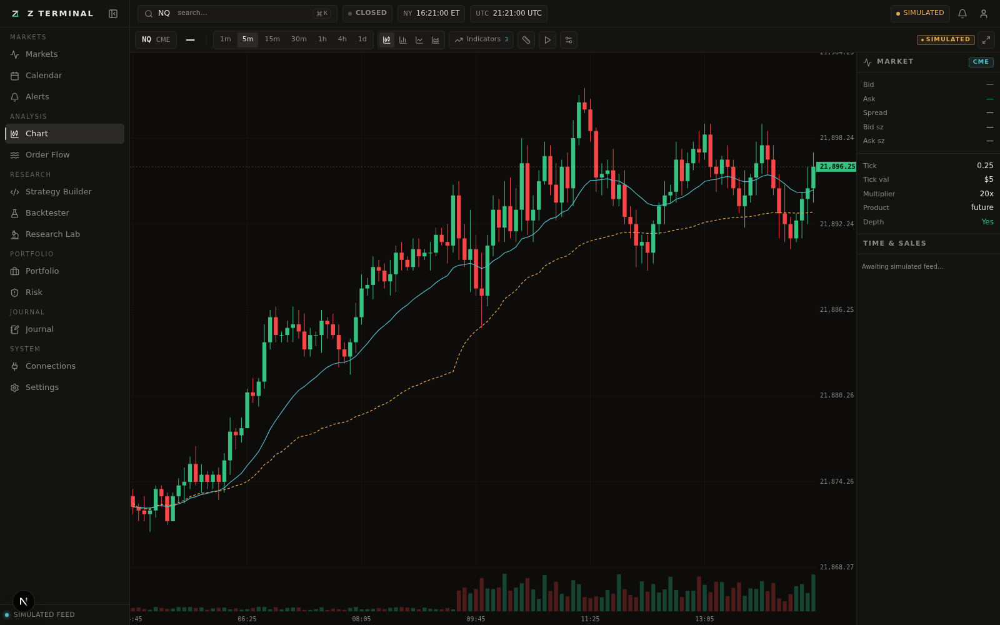
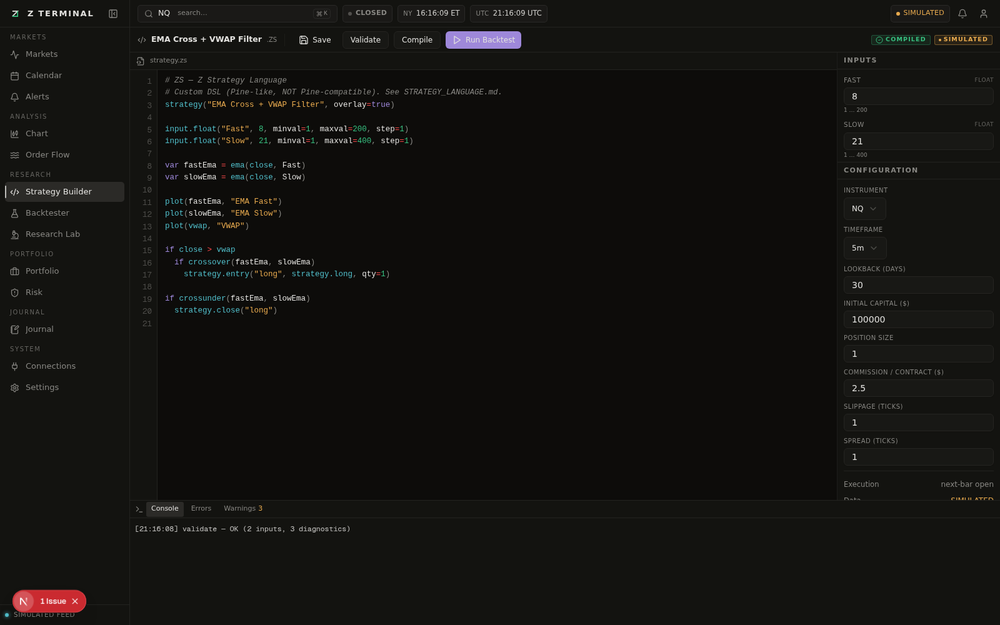
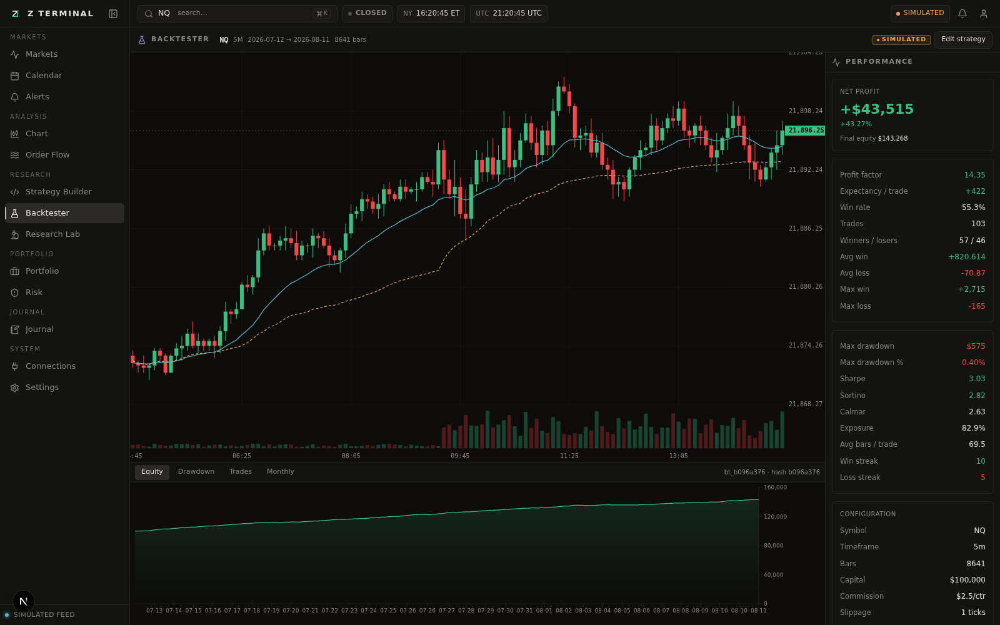
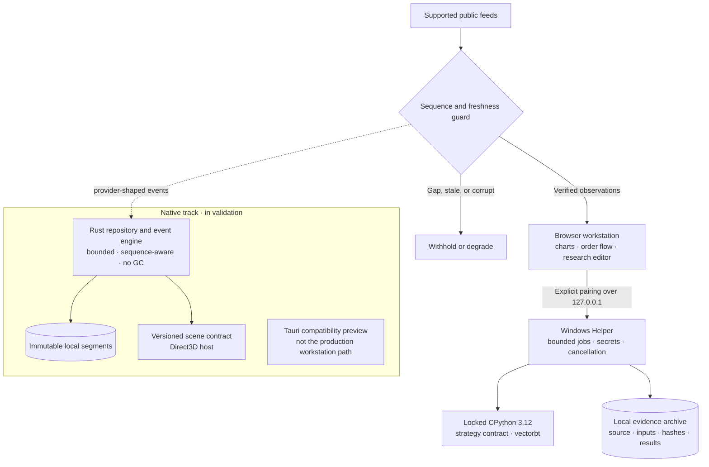

<div align="center">


# ZTerminal

### See Further. Guess Less.

<p>
  <a href="LICENSE"></a>
  
  
  
  
</p>

ZTerminal exists so market research can remain sovereign: your strategy source, selected data, credentials, and run evidence stay under your control. It turns a trading idea into inspectable evidence on local compute—without outsourcing the work that contains your edge.

[Research loop](#the-quant-loop) · [System boundary](#the-sovereign-machine) · [Architecture](#architecture--integrity) · [Build](#quickstart) · [Release status](#pre-release-verification-status)

<!--
HERO SCREENSHOT DROP
Replace verify-chart2.png below with a polished 2x capture at docs/assets/hero-interface.png.
Recommended frame: 1600 × 900, chart workspace visible, no credentials or personal data.
Then update src to: docs/assets/hero-interface.png
-->



<sub>Chart-first by construction. Feed state, instrument context, and research controls remain visible.</sub>

</div>

---

## The Sovereign Machine

Most trading software asks for one of two compromises: a thin chart that hides market structure, or a hosted research environment that receives the strategy, the dataset, and the keys.

ZTerminal draws a harder boundary.

**The browser is the instrument panel.** It owns investigation: charts, drawings, studies, order-flow views, strategy source, parameters, and run comparison. Lightweight Charts keeps the market in the foreground rather than burying it beneath application chrome.

**The Windows Helper is the local execution boundary.** After an explicit pairing, the terminal sends approved research requests over `127.0.0.1`. The Helper runs the locked Python environment, stores persistent secrets through the local boundary, and commits strategy source, dataset identity, configuration, and results to a local archive.

```text
INVESTIGATE                                      EXECUTE

Browser workspace                               Windows Helper
charts · context · source · parameters          trusted local Python · secrets · archives
        │                                                │
        └──── explicit pairing · 127.0.0.1 only ─────────┘
                         no hosted research worker
```

<!--
ARCHITECTURE SCREENSHOT DROP
Add a polished pairing / local-helper boundary visual at docs/assets/local-boundary.png.
Insert it immediately below the diagram with:

-->

That separation has consequences:

- Strategy code is not executed in the hosted application.
- Helper traffic binds to loopback, validates the exact site origin, and requires a paired bearer token.
- Successful runs retain source, configuration, engine versions, assumptions, and SHA-256 identities.
- A market-data gap becomes a gap. An unavailable input remains unavailable. Neither is repaired with invented data.
- No broker execution or order-routing authority is present.

No third-party research queue receives the strategy source or dataset. There is no hosted worker with privileged access to unpublished logic.

> **Local is a boundary, not a slogan.** Loopback traffic does not make an internet-connected machine air-gapped. The Helper runs trusted code with the current Windows user's permissions, and that code can access local files or the network. True air-gapped operation requires a disconnected host and locally supplied inputs.

## The Quant Loop

ZTerminal is organized around a single discipline:

> **hypothesis → code → configure → run → understand → change one thing → rerun**

- **Hypothesis.** Begin with a falsifiable market claim, not a dashboard of unrelated signals.
- **Code.** Express the rule in standard Python. The current locked Helper pairs CPython 3.12.10 with vectorbt 0.28.1 and a versioned ZTerminal strategy contract.
- **Configure.** Make dates, symbols, costs, slippage, sizing, parameters, and execution assumptions explicit inputs.
- **Run.** Evaluate completed-bar signals at the next bar's open. Inputs are bounded, validated, and hashed before the result is accepted.
- **Understand.** Read trades, equity, drawdown, diagnostics, plots, provenance, and failure states beside the chart that produced the question.
- **Change one thing.** Preserve the parent run and record the variable that changed.
- **Rerun.** Identical inputs resolve to the same research identity. Differences remain attributable.

<!--
RESEARCH SCREENSHOT DROP
Replace verify-strategy.png and verify-final-backtest.png below with polished captures at:
- docs/assets/strategy-workspace.png
- docs/assets/evidence-report.png
Keep both images at the same aspect ratio for a balanced GitHub table.
-->

<table>
  <tr>
    <td width="50%"></td>
    <td width="50%"></td>
  </tr>
  <tr>
    <td><strong>Code with constraints.</strong><br /><sub>Parameters, costs, instrument, timeframe, and execution model are visible before the run.</sub></td>
    <td><strong>Evidence with provenance.</strong><br /><sub>Trades, equity, drawdown, metrics, configuration, and the determinism hash stay together.</sub></td>
  </tr>
</table>

### Market structure without invented certainty

The live web path maintains sequence-aware local books for supported public feeds. Binance depth is bootstrapped from a snapshot, linked by update sequence, and invalidated when continuity breaks; Gate.io and Binance trades feed deterministic order-flow calculations. CVD, footprint bins, imbalance, microprice, and large-trade overlays are derived from observed inputs and carry provider and health context.

Historical event reconstruction is held to a stricter contract: recorded availability time, ingress order, stream identity, batch order, atomic book snapshots, and explicit quality epochs. That event-mode recorder and replay path is under active validation and is **not** represented as a finished public feature.

### Research engines, stated precisely

| Surface | What is usable now | Integrity boundary |
| --- | --- | --- |
| Chart investigation | Lightweight Charts, drawings, studies, persisted chart documents, and order-flow views | Feed health and provider provenance remain visible |
| Local candle research | Locked Python 3.12.10 Helper, vectorbt 0.28.1, deterministic next-open execution, archived hashes, and bounded Monte Carlo primitives | Arbitrary user Python can still introduce lookahead; ZTerminal does not certify causal logic |
| Columnar research | Polars is part of the standard-Python and columnar-engine direction | Polars is not bundled in the current Helper lock and is not claimed as a shipped execution dependency |
| Event research | Versioned contracts for sequence, availability, atomic books, immutable fragments, and replay order | Execution and public recorder delivery remain gated pending end-to-end certification |

This distinction is deliberate. A feature becomes a product claim only after its data path, failure semantics, and reproducibility record exist together.

## Architecture & Integrity



The system uses different runtimes for different failure budgets:

- **Rust owns bounded, sequence-sensitive local work.** The engine rejects duplicates, reports discontinuities, aggregates only observed events, and avoids garbage-collection pauses in its critical path.
- **Python owns research expression.** It runs out of process, under time, CPU, memory, and process-count limits, with exact package versions recorded in the result.
- **The web terminal owns visual inquiry.** It remains responsive while local work is cancellable and independently supervised.
- **Tauri remains a compatibility preview.** The production Windows direction is a native host with a Rust engine and Direct3D chart surface; the current native track is still pre-release.

The committed Rust fixture benchmark processed 100,000 deterministic events in **0.790 ms** on its recorded environment. That number is evidence about one local algorithm path—not an exchange-to-screen latency promise, an execution guarantee, or a substitute for hardware-tier validation.

## Quickstart

Prerequisites: Node.js with npm, the stable Rust toolchain, and—when running the research suites or packaging the Helper—the Windows `py` launcher with CPython 3.12 installed.

### Run the web workstation

From PowerShell, provide the local SQLite URL for the development session, install the locked JavaScript dependencies, and start the terminal:

```powershell
$env:DATABASE_URL = "file:./dev.db"
npm install
npm run dev
```

Open [http://localhost:3000/terminal](http://localhost:3000/terminal).

The default development provider is synthetic and explicitly labelled. Live public data depends on provider availability and region; ZTerminal reports degraded or unavailable state rather than silently substituting a fixture.

### Verify the repository

```powershell
npm run typecheck
npm test
npm run lint
cargo test --workspace --all-targets
npm run test:python
```

The Python suite requires CPython 3.12, then creates an isolated environment from the repository locks. The machine-global interpreter is not the supported research test path.

### Build the private Windows Helper

The Helper is a private preview, not a public download. Prepare the verified CPython 3.12.10 Windows x64 embedded runtime at `out/research-runtime`, install `research/desktop/requirements.lock` into that runtime, then build the private package:

```powershell
powershell -ExecutionPolicy Bypass -File research/desktop/build-private.ps1
```

The build verifies the Python and vectorbt versions, retains third-party notices, records file hashes, and produces a local ignored archive. It does not publish or upload the artifact.

### Institutional deployment gate

A candidate deployment is acceptable only when every relevant layer passes:

```powershell
npm run typecheck
npm test
npm run build
cargo fmt --all -- --check
cargo clippy --workspace --all-targets -- -D warnings
cargo test --workspace --all-targets
npm run test:python
```

Production operators must also verify live provider synchronization, explicit stale/degraded states, secret isolation, origin restrictions, release hashes, and the absence of tracked credentials. Hosted services are not a research worker and must never receive strategy execution authority.

## What ZTerminal Refuses to Pretend

- It does not place orders.
- It does not guarantee outcomes or convert a backtest into evidence of future performance.
- It does not claim a complete historical event recorder or authoritative tick replay today.
- It does not ship AI strategy generation, Deribit options GEX, or multi-tenant cloud synchronization.
- It does not call missing data zero, call a broken book live, or call an unsigned preview a release.

Backtests are hypothetical. Fees, slippage, fill assumptions, provider semantics, and data quality can materially change a result. Research is decision support, not investment advice.

## Pre-Release Verification Status

> **Beta · source available · public Windows binaries withheld**

ZTerminal is in active beta. The web workstation, deterministic test suites, Rust foundations, and private local-research path are available for inspection and development; the native Windows workstation remains under measured validation.

No unverified Windows binary is distributed. Public delivery remains disabled until the package has passed compatibility checks, cryptographic publisher signing, timestamp verification, SHA-256 verification, release-manifest validation, and documented installation testing.

For the exact engineering boundary, read [Local Research](docs/LOCAL_RESEARCH.md), [Backtesting](docs/BACKTESTING.md), [Microstructure Architecture](docs/MICROSTRUCTURE_ARCHITECTURE.md), and the [Windows Local-First Product Boundary](docs/windows/LOCAL_FIRST_PRODUCT_BOUNDARY.md).

---

Released under the [MIT License](LICENSE).
