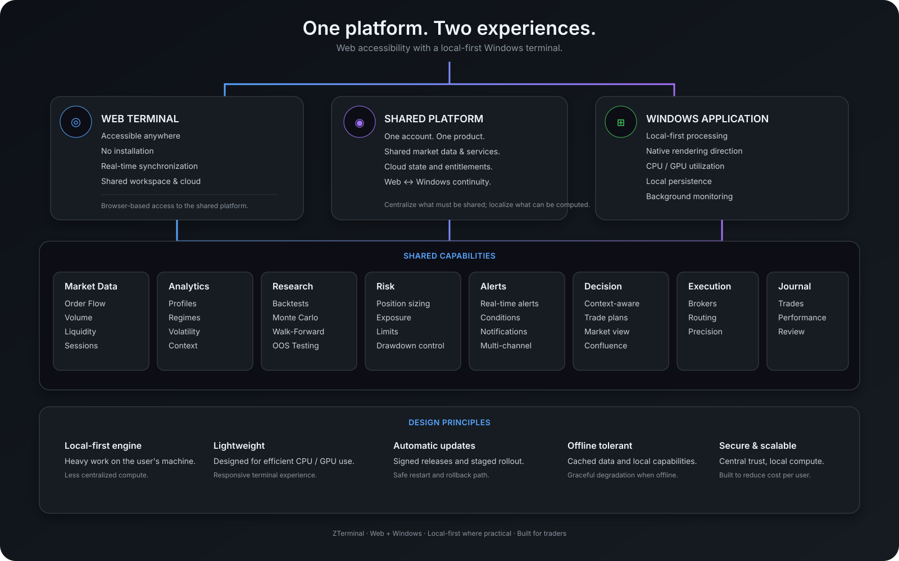

  

<h1 align="center">ZTerminal</h1>

  <strong>Quantitative market intelligence evolving into a lightweight Windows trading terminal.</strong>

  Research · Market Context · Order Flow · Risk · Alerts · Journaling

  <a href="https://zterminal.onrender.com">Web App</a> · <a href="#windows-desktop">Windows Desktop</a> · <a href="#roadmap">Roadmap</a> · <a href="#contributing">Contributing</a>

  
  
  
  

  

---

## What is ZTerminal?

ZTerminal is a **quantitative market research, decision-support, and trading terminal project** for traders who want more than charts and disconnected indicators.

It brings market context, strategy research, statistical validation, risk analysis, alerts and trade review into one workflow.

> **Don't trade because a chart looks right. Trade because you understand the setup.**

**Research → Validate → Monitor → Decide → Execute → Review**

---

## The ZTerminal strategy

ZTerminal is evolving from a primarily web-based application into a **web + lightweight Windows terminal platform**.

The web application remains the accessible, cross-platform experience. The Windows client is being designed as the higher-performance environment where appropriate computation and rendering can happen locally on the user's computer instead of requiring every heavy workload to run on shared infrastructure.

  

The goal is **not** to put the website inside an `.exe`. The goal is to build a proper lightweight desktop terminal around the same ZTerminal platform.

---

## Why local-first Windows?

The Windows strategy is **local-first where practical**. Work that can be performed efficiently and safely on the user's CPU, GPU, memory and storage should be evaluated for local execution first.

Central infrastructure remains responsible for functionality that genuinely requires centralized coordination, including authentication, entitlements, shared services, cloud synchronization, remote configuration and release distribution.

The exact local/server boundary will be refined through benchmarking rather than assumed in advance.

---

## Core capabilities

### Market Intelligence

VWAP · Opening Range · Volume Profile · POC / VAH / VAL · HVN / LVN · Order Flow · Volatility · Market Regimes · Session Context

### Quantitative Research

Strategy rules · Historical backtesting · Expectancy · Profit factor · Drawdown · R-multiple analysis · Monte Carlo · Walk-forward testing · Out-of-sample analysis

### Risk & Decision Support

Position sizing · Stop / target planning · Dollar risk · R:R · Exposure · Drawdown monitoring · Risk limits

### Monitoring & Review

Context-aware alerts · Setup monitoring · Trade journaling · Execution analysis · Strategy performance · Trader performance · Historical comparisons

---

## Windows Desktop

The long-term Windows application is being designed as a **lightweight native terminal**, not as a browser wrapper.

The native direction is centered around **Rust + native Windows technologies such as Win32/Direct3D**, with local-first computation and rendering where it provides a meaningful performance benefit.

Planned capabilities include:

* Native high-performance rendering
* CPU/GPU utilization on the user's machine
* Local chart and order-flow processing where practical
* Persistent local workspaces
* Multi-window and multi-monitor workflows
* Native notifications
* Global shortcuts
* Background monitoring
* Lower dependence on centralized compute

The current Tauri-based Windows build is treated as an **internal packaging/proof track**, not as the final native architecture.

### Web + Windows, not Web vs. Windows

**Web:** instant, cross-platform access without installation.

**Windows:** a dedicated terminal environment with local-first processing and deeper desktop integration.

Both are intended to use the same ZTerminal account and shared platform.

---

## Desktop distribution and automatic updates

Users should **not** have to return to the website and manually reinstall ZTerminal for every release.

The production Windows release system is designed around:

* Signed releases
* Versioned artifacts
* Signed release manifests
* CDN / object-storage distribution
* Background update checks
* Staged rollouts
* Release pause / rollback
* Separation of application binaries from user data

The website and Windows updater will use one canonical release source of truth.

---

## Remote configuration

Not every safe product change should require a full binary release.

ZTerminal is therefore being designed to support **validated remote configuration** for explicitly approved behavior such as feature visibility, defaults and maintenance state.

Remote configuration is **not** intended to become a mechanism for downloading or executing arbitrary code.

---

## Scalable by design

The Windows architecture is also a scalability strategy: use the user's hardware for appropriate local computation and rendering while keeping centralized infrastructure focused on shared data, identity, entitlements, synchronization, release distribution and other services that require central coordination.

The objective is to reduce unnecessary server-side compute and improve the cost and scalability profile as the user base grows.

---

## Development strategy

### Track A — Windows packaging proof

Windows builds · installer behavior · test signing · artifact verification · controlled internal distribution.

This is an engineering proof track, not the final native terminal.

### Track B — Native Windows terminal

Rust · native Windows APIs · Direct3D/native rendering · local-first computation · high-performance charting · order-flow visualization · persistent workspaces · desktop integration.

### Shared release spine

Versioning · release metadata · signing · distribution · update strategy · rollback · remote configuration.

Public Windows distribution should only be enabled when the appropriate production gates have passed.

---

## Roadmap

### Research

* [x] Initial research workflow
* [x] Strategy-oriented foundation
* [ ] Advanced backtesting
* [ ] Monte Carlo analysis
* [ ] Walk-forward validation
* [ ] Parameter sensitivity
* [ ] Expanded statistical research

### Market Intelligence

* [ ] Advanced market-regime detection
* [ ] Deeper volume-profile analytics
* [ ] Expanded order-flow analysis
* [ ] Cross-market context
* [ ] Additional real-time data integrations

### Risk & Monitoring

* [ ] Advanced risk engine
* [ ] Context-rich alerts
* [ ] Exposure analytics
* [ ] Advanced trade-plan workspace

### Review

* [ ] Automated journaling
* [ ] Execution analytics
* [ ] Strategy vs. trader performance
* [ ] Performance attribution

### Windows Desktop

* [ ] Internal Windows packaging validation
* [ ] Signed installer pipeline
* [ ] Native Windows client foundation
* [ ] Rust / native rendering architecture
* [ ] Direct3D charting foundation
* [ ] Local-first analytics
* [ ] Persistent workspaces
* [ ] Multi-window / multi-monitor workflows
* [ ] Native notifications
* [ ] Global shortcuts
* [ ] Background monitoring
* [ ] Windows auto-update system
* [ ] Canonical release manifest
* [ ] CDN / object-storage distribution
* [ ] Staged releases and rollback
* [ ] Public Windows download

### Platform

* [ ] Shared web/desktop account architecture
* [ ] Remote configuration
* [ ] Cloud synchronization where appropriate
* [ ] Release management tooling
* [ ] Production observability

---

## Philosophy

**Evidence over intuition.** A compelling chart is not evidence by itself.

**Context over isolated indicators.** A number without context is just another number.

**Risk before conviction.** Know what you're risking before thinking about what you might make.

**Robustness over optimization.** A stable strategy is more interesting than a perfectly optimized backtest.

**Local compute where it makes sense.** Use the user's hardware when it is efficient and safe to do so.

**Human control over blind automation.** Automation should remove repetitive work, not remove responsibility.

---

## Status

ZTerminal is an **actively developing project**.

The web application is the current accessible product experience. The Windows architecture is being developed toward a lightweight, native, local-first terminal designed to reduce unnecessary server-side computation and provide a deeper desktop workflow.

The native Windows client, public desktop distribution and automatic-update infrastructure are being developed incrementally and should not be interpreted as fully production-ready merely because they appear in the roadmap.

---

## Contributing

ZTerminal is being developed with a focus on quantitative correctness, reliable market data, research integrity, risk management, performance, security, scalable architecture and maintainability.

Before proposing a large feature, ask:

> **Does this make the trading research and decision workflow meaningfully better?**

---

## Disclaimer

ZTerminal is software for market analysis, research and decision support. It does not guarantee profitability or future performance. Backtested results are hypothetical and do not guarantee future results. Market data may be delayed, incomplete or inaccurate. Trading involves substantial risk. Users are responsible for their own decisions and losses.

---

<strong>ZTerminal</strong> 
Quantitative market intelligence — evolving into a lightweight Windows terminal.

