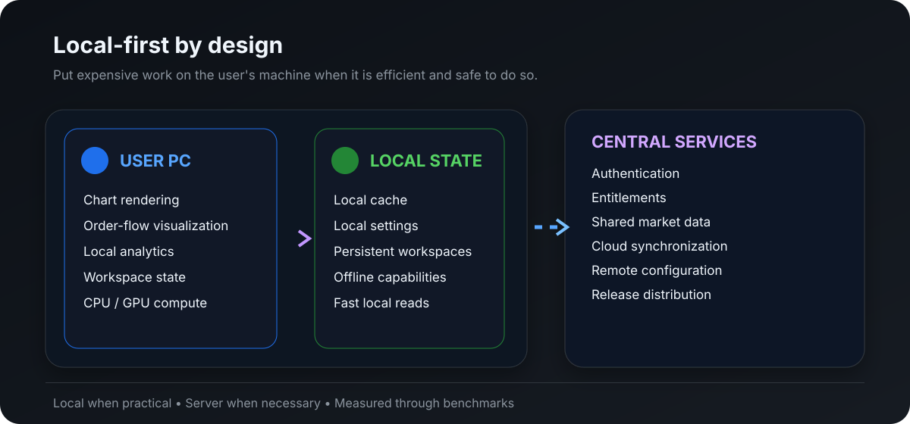
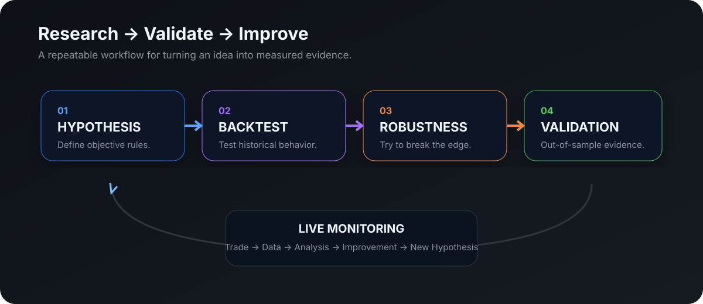
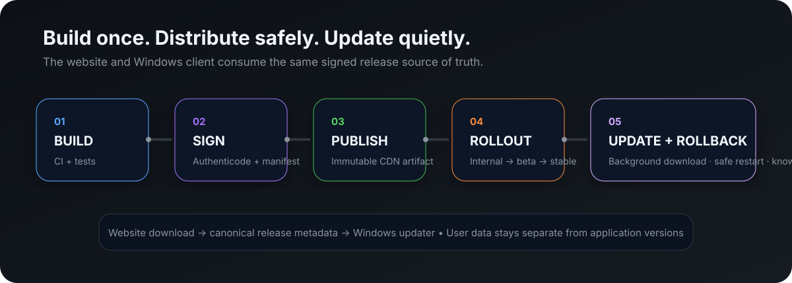

<p align="center">
  
</p>

<h1 align="center">ZTerminal</h1>

<p align="center">
  <strong>Quantitative market intelligence in a focused, browser-first trading workspace.</strong>
</p>

<p align="center">
  Research · Market Context · Order Flow · Risk · Alerts · Journaling
</p>

<p align="center">
  <a href="https://zterminal.onrender.com">Web App</a> · <a href="#windows-desktop">Windows Desktop</a> · <a href="#architecture">Architecture</a> · <a href="#roadmap">Roadmap</a> · <a href="#contributing">Contributing</a>
</p>

<p align="center">
  
  
  
  
  
</p>

<p align="center">
  
</p>

---

## What is ZTerminal?

ZTerminal is a **quantitative market research, decision-support, and trading terminal project** for traders who want more than charts and disconnected indicators.

It brings market context, strategy research, statistical validation, risk analysis, alerts and trade review into one workflow.

> **Don't trade because a chart looks right. Trade because you understand the setup.**

**Research → Validate → Monitor → Decide → Execute → Review**

---

## Architecture

ZTerminal is being designed around a **client-first, server-light architecture**.

The core idea is simple:

> **Use the user's computer for computation whenever it is practical, while keeping the server responsible for the minimum amount of centralized work required to operate the platform reliably.**

<p align="center">
  
</p>

This is both a performance strategy and a **scalability/cost strategy**. Heavy workloads should not automatically become server workloads simply because a user opened ZTerminal.

### User computer — preferred location for heavy work

The browser client is intended to use the user's available **CPU, GPU, RAM and local storage** for workloads that can safely run locally, such as:

- Chart rendering and visualization
- Local market-data processing
- Order-flow and footprint calculations
- Indicator calculations
- Statistical calculations
- Backtesting and research workloads
- Monte Carlo and other compute-heavy analysis
- Local caching and preprocessing
- Workspace state and other non-authoritative local data

A user's machine can therefore contribute the compute required for their own session instead of forcing every calculation through shared infrastructure.

### Central server — shared services only

The backend should remain focused on work that actually benefits from centralized control, such as:

- Authentication and account management
- Subscription / entitlement checks
- Shared configuration and feature flags
- Secure API mediation where required
- Shared data synchronization
- Release metadata and application updates
- Centralized notifications or events when necessary
- Service health, telemetry and operational controls
- Authoritative state that must remain consistent across devices

The server should **not become the default compute engine for every user's heavy analytics workload** when that workload can be performed locally.

### A practical rule

For every feature, ZTerminal should ask:

> **Does this computation need to happen on our infrastructure, or can the user's machine do it just as well?**

If local execution is practical, secure and reliable, **local-first is the default**.

This boundary will be determined through real benchmarking, reliability testing and product requirements rather than by blindly moving everything to either side.

---

## Why client-first?

A traditional cloud-heavy design can make every user compete for centralized CPU, memory and compute resources. That increases infrastructure requirements as usage grows.

ZTerminal instead aims to make the user's device responsible for as much appropriate computation as possible.

Conceptually:

```text
Traditional cloud-heavy model

10,000 users
    ↓
10,000 users × heavy compute
    ↓
Central infrastructure carries most of the workload


ZTerminal client-first model

10,000 users
    ↓
10,000 local clients perform appropriate compute
    ↓
Lightweight requests / shared services / synchronization
    ↓
Central infrastructure handles coordination, identity and shared state
```

This does **not** mean “no backend” or “everything is local.” Some data, services, security controls and authoritative operations must remain centralized.

The goal is to avoid paying server-side compute costs for work that a user's computer can perform efficiently itself.

---

## The ZTerminal strategy

ZTerminal is a **web-only, browser-first application**.

The web app is the product surface and cross-platform experience; local browser compute is used where it improves charting and research responsiveness.

<p align="center">
  
</p>

The goal is a reliable, responsive web workspace with truthful data states and no native-app dependency.

---

## Core capabilities

### Market Intelligence

VWAP · Opening Range · Volume Profile · POC / VAH / VAL · HVN / LVN · Order Flow · Volatility · Market Regimes · Session Context

### Quantitative Research

Strategy rules · Historical backtesting · Expectancy · Profit factor · Drawdown · R-multiple analysis · Monte Carlo · Walk-forward testing · Out-of-sample analysis

<p align="center">
  
</p>

### Risk & Decision Support

Position sizing · Stop / target planning · Dollar risk · R:R · Exposure · Drawdown monitoring · Risk limits

### Monitoring & Review

Context-aware alerts · Setup monitoring · Trade journaling · Execution analysis · Strategy performance · Trader performance · Historical comparisons

---

## Deferred native clients (out of scope)

The long-term Windows application is being designed as a **lightweight native terminal**, not as a browser wrapper.

The native direction is centered around **Rust + native Windows technologies such as Win32/Direct3D**, with local-first computation and rendering where it provides a meaningful performance and scalability benefit.

Planned capabilities include:

- Native high-performance rendering
- CPU/GPU utilization on the user's machine
- Local chart, indicator and order-flow processing where practical
- Local backtesting and research execution where practical
- Persistent local workspaces and caches
- Multi-window and multi-monitor workflows
- Native notifications
- Global shortcuts
- Background monitoring
- Reduced dependence on centralized compute

The current Tauri-based Windows build is treated as an **internal packaging/proof track**, not as the final native architecture.

### Web + Windows, not Web vs. Windows

**Web:** instant, cross-platform access without installation.

**Windows:** a dedicated terminal environment with local-first processing, more available local compute and deeper desktop integration.

Both are intended to use the same ZTerminal account and shared platform, while respecting the different capabilities of each environment.

---

## Data and compute flow

ZTerminal should prefer a pipeline similar to:

```text
                 ┌─────────────────────────────┐
                 │        ZTerminal Server      │
                 │                             │
                 │ Auth / Entitlements         │
                 │ Shared services             │
                 │ Sync / Config               │
                 │ Release management          │
                 │ Minimal centralized compute │
                 └──────────────┬──────────────┘
                                │
                      lightweight requests
                         shared state/data
                                │
          ┌─────────────────────┴─────────────────────┐
          │                                           │
          ▼                                           ▼
┌──────────────────────┐                    ┌──────────────────────┐
│      User PC A       │                    │      User PC B       │
│                      │                    │                      │
│ CPU / GPU compute    │                    │ CPU / GPU compute    │
│ Charts               │                    │ Charts               │
│ Order flow           │                    │ Order flow           │
│ Backtesting          │                    │ Backtesting          │
│ Analytics            │                    │ Analytics            │
│ Local cache          │                    │ Local cache           │
└──────────────────────┘                    └──────────────────────┘
```

The exact boundary is feature-dependent. For example, **authoritative account state** belongs on the server, while a user's temporary analytical calculation generally does not.

---

## Web delivery

Users should **not** have to return to the website and manually reinstall ZTerminal for every release.

<p align="center">
  
</p>

The production Windows release system is designed around:

- Signed releases
- Versioned artifacts
- Signed release manifests
- CDN / object-storage distribution
- Background update checks
- Staged rollouts
- Release pause / rollback
- Separation of application binaries from user data

The website and Windows updater will use one canonical release source of truth.

---

## Remote configuration

Not every safe product change should require a full binary release.

ZTerminal is therefore being designed to support **validated remote configuration** for explicitly approved behavior such as feature visibility, defaults and maintenance state.

Remote configuration is **not** intended to become a mechanism for downloading or executing arbitrary code.

---

## Scalable by design

ZTerminal's architecture is intentionally designed so that **adding users does not automatically mean adding the same amount of server-side compute**.

The preferred scaling model is:

```text
More users
    ↓
More client-side compute
    +
Moderate growth in shared backend traffic
```

rather than:

```text
More users
    ↓
More users × heavy centralized computation
    ↓
Rapid growth in CPU / RAM / compute infrastructure
```

This can improve the cost profile of analytics-heavy features because the compute required for one user's local analysis is primarily supplied by that user's own machine.

That said, network bandwidth, storage, market-data licensing, authentication, synchronization, observability and other shared services still scale with the platform and must be engineered accordingly.

The architecture therefore optimizes for **efficient distribution of workload**, not the unrealistic goal of zero server costs.

---

## Security boundary

Client-first does **not** mean trusting the client with authoritative decisions.

The server remains the source of truth for security-sensitive and account-sensitive operations where appropriate. Local computation should generally operate on data and tasks that do not require the backend to blindly trust client-provided results.

For example:

- Authentication and entitlements should be server-controlled.
- Subscription state should be validated centrally.
- Sensitive credentials and server secrets must never be embedded in the client.
- Local calculations can be performed locally, but authoritative account state should remain centralized.
- Anti-tampering and integrity controls should be applied where product requirements demand them.

The architecture aims to move **compute**, not **trust boundaries**, to the user's machine.

---

## Development strategy

### Track A — Windows packaging proof

Windows builds · installer behavior · test signing · artifact verification · controlled internal distribution.

This is an engineering proof track, not the final native terminal.

### Track B — Native Windows terminal

Rust · native Windows APIs · Direct3D/native rendering · local-first computation · high-performance charting · order-flow visualization · persistent workspaces · desktop integration.

### Track C — Client/server workload separation

For every major feature:

1. Identify what must be centralized.
2. Identify what can safely run locally.
3. Benchmark both sides.
4. Minimize unnecessary backend CPU and memory usage.
5. Keep authoritative state and security controls centralized.
6. Cache and batch network activity where practical.

### Shared release spine

Versioning · release metadata · signing · distribution · update strategy · rollback · remote configuration.

Public Windows distribution should only be enabled when the appropriate production gates have passed.

---

## Roadmap

### Research

- [x] Initial research workflow
- [x] Strategy-oriented foundation
- [ ] Advanced backtesting
- [ ] Monte Carlo analysis
- [ ] Walk-forward validation
- [ ] Parameter sensitivity
- [ ] Expanded statistical research

### Market Intelligence

- [ ] Advanced market-regime detection
- [ ] Deeper volume-profile analytics
- [ ] Expanded order-flow analysis
- [ ] Cross-market context
- [ ] Additional real-time data integrations

### Risk & Monitoring

- [ ] Advanced risk engine
- [ ] Context-rich alerts
- [ ] Exposure analytics
- [ ] Advanced trade-plan workspace

### Review

- [ ] Automated journaling
- [ ] Execution analytics
- [ ] Strategy vs. trader performance
- [ ] Performance attribution

### Browser workspace

- [x] Responsive browser workspace
- [ ] Client/server workload separation framework
- [ ] Local-first analytics
- [ ] Local backtesting / compute engine
- [ ] Local market-data processing and caching
- [ ] Persistent workspaces
- [ ] Background monitoring

### Platform

- [ ] Shared account architecture
- [ ] Remote configuration
- [ ] Cloud synchronization where appropriate
- [ ] Central service minimization
- [ ] Release management tooling
- [ ] Production observability
- [ ] Workload benchmarking and cost monitoring

---

## Philosophy

**Evidence over intuition.** A compelling chart is not evidence by itself.

**Context over isolated indicators.** A number without context is just another number.

**Risk before conviction.** Know what you're risking before thinking about what you might make.

**Robustness over optimization.** A stable strategy is more interesting than a perfectly optimized backtest.

**Local compute where it makes sense.** Use the user's hardware when it is efficient, safe and reliable to do so.

**Centralize what must be centralized.** Identity, entitlements, authoritative state and shared services belong where centralized control provides real value.

**Minimize unnecessary infrastructure.** Server capacity should be spent on shared platform responsibilities, not avoidable per-user computation.

**Human control over blind automation.** Automation should remove repetitive work, not remove responsibility.

---

## Status

ZTerminal is an **actively developing project**.

The web application is the product. ZTerminal keeps appropriate charting and research computation in the browser while the backend provides authoritative market-data mediation, account boundaries, health checks and shared services.

Native Windows clients and desktop distribution are explicitly deferred and are not implementation targets for this repository.

---

## Contributing

ZTerminal is being developed with a focus on quantitative correctness, reliable market data, research integrity, risk management, performance, security, scalable architecture and maintainability.

Before proposing a large feature, ask:

> **Does this make the trading research and decision workflow meaningfully better?**

And for implementation:

> **Does this really need server-side compute, or can the user's machine handle it?**

---

## Disclaimer

ZTerminal is software for market analysis, research and decision support. It does not guarantee profitability or future performance. Backtested results are hypothetical and do not guarantee future results. Market data may be delayed, incomplete or inaccurate. Trading involves substantial risk. Users are responsible for their own decisions and losses.

---

<p align="center">
<strong>ZTerminal</strong><br />
<sub>Quantitative market intelligence / a lightweight, client-first analysis terminal.</sub>
</p>
