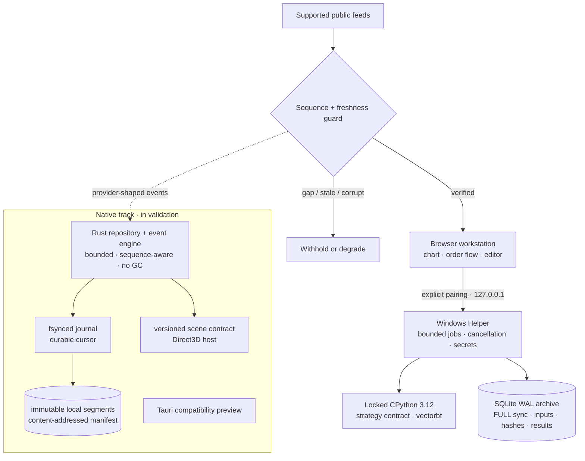

<div align="center">


# ZTerminal

### See Further. Guess Less.

**A chart-first quantitative research workspace for traders who require evidence before conviction.**

<p>
  <a href="https://github.com/zephyriaa/zterminal/actions/workflows/quality.yml"></a>
  <a href="LICENSE"></a>
  
  
  
  
</p>

<p>
  <a href="#quickstart"><strong>Run locally</strong></a> ·
  <a href="#system-design"><strong>System design</strong></a> ·
  <a href="#research-integrity"><strong>Research integrity</strong></a> ·
  <a href="#beta-boundary"><strong>Beta boundary</strong></a>
</p>

ZTerminal keeps the critical research path under your control: strategy source, selected data, credentials, and result evidence stay on local hardware. The product exists to turn a market hypothesis into a reproducible decision record—not another disposable backtest.

<!--
POLISHED HERO CAPTURE
Replace verify-chart2.png with docs/assets/hero-terminal.png.
Recommended export: 1600 × 900 at 2x density, no browser chrome, credentials, or personal data.
Then change the src below to docs/assets/hero-terminal.png.
-->


<sub>Chart, context, studies, and feed state in one research surface.</sub>

</div>

---

## Why ZTerminal

Retail terminals compress market structure into decoration. Hosted research platforms ask you to upload the strategy, the dataset, and often the credentials that define your edge. ZTerminal rejects both compromises.

| Market truth | Research discipline | Local sovereignty |
| --- | --- | --- |
| Sequence-aware books fail closed on gaps instead of inventing continuity. | Completed-bar signals execute at the next open; costs and parameters remain explicit. | Approved Python runs through a paired loopback Helper, not a hosted research worker. |
| Order-flow measures are derived from observed trades and depth. | Source, dataset, configuration, engine versions, and results receive stable identities. | Strategy archives and persistent secrets remain inside the local boundary. |
| Stale, degraded, and unavailable are first-class states. | One declared change separates an experiment from its parent run. | Local execution is cancellable, bounded, and independently supervised. |

> **Own the question. Own the compute. Own the evidence.**

## The Quant Loop

```text
hypothesis → code → configure → run → understand → change one thing → rerun
```

1. **State a falsifiable hypothesis.** Start with a market claim, not a pile of indicators.
2. **Express the rule.** Use standard Python and a versioned strategy contract.
3. **Declare the assumptions.** Symbol, range, costs, slippage, sizing, parameters, and execution model are inputs—not footnotes.
4. **Run against complete data.** Missing, duplicate, malformed, or open candles invalidate the request.
5. **Read the evidence.** Trades, equity, drawdown, diagnostics, provenance, and hashes remain attached to the run.
6. **Change one variable.** Preserve the baseline and make the next result attributable.

> The workflow is designed to resist the researcher. Future bars remain unavailable to the decision that precedes them, baselines remain identifiable, and incremental runs record the variable that changed.

<!--
POLISHED RESEARCH CAPTURES
Replace the two images below with equal-aspect exports:
  docs/assets/strategy-workspace.png
  docs/assets/evidence-report.png
Recommended export: 1440 × 900 each, identical crop and density.
-->

<table>
  <tr>
    <td width="50%"></td>
    <td width="50%"></td>
  </tr>
  <tr>
    <td><strong>Code with constraints.</strong><br /><sub>The execution model and every material input are visible before the run.</sub></td>
    <td><strong>Evidence with provenance.</strong><br /><sub>Performance, configuration, and research identity stay together after it.</sub></td>
  </tr>
</table>

## Market Structure, Without Theatre

The active web path supports public Gate.io and Binance market data, deterministic order-flow calculations, feed-health states, and sequence-aware local books. Binance depth is admitted only after a valid snapshot bridge; a continuity break invalidates the book and starts recovery.

- **CVD** measures observed aggressive buy quantity minus observed aggressive sell quantity.
- **Footprint** bins observed trade volume by time and tick-aligned price.
- **Imbalance** and **microprice** use verified nearest-level depth.
- **Large-trade overlays** aggregate prints without rewriting their observed side or price.
- **Replay-aware studies** stop at the active replay boundary.

Historical event reconstruction has a stricter contract—availability time, ingress order, stream identity, atomic batches, and quality epochs. That recorder/replay path remains under certification and is not presented as a finished public feature.

## Research Integrity

| Invariant | Enforcement |
| --- | --- |
| No same-bar clairvoyance | A completed-bar signal fills at the next bar's open. |
| No silent history truncation | Requested candles must be present, unique, structurally valid, closed, and inside the exact range. |
| No invisible cost model | Commission, slippage, tick size, multiplier, and position size are explicit inputs. |
| No anonymous result | Successful runs retain source, dataset, parameters, assumptions, engine versions, and SHA-256 identities. |
| No manufactured market state | Gaps, stale inputs, and unavailable data are surfaced rather than replaced. |

The current private Helper locks CPython 3.12.10 and vectorbt 0.28.1. Polars belongs to the columnar research direction but is not bundled in the current Helper lock; this README does not present it as an active execution dependency. Arbitrary Python can still encode lookahead or access local resources, so strategies must be reviewed as trusted code.

## System Design



| Runtime | Responsibility | Trader impact |
| --- | --- | --- |
| Browser workstation | Visual inquiry, chart interaction, source editing, run comparison | The market and the assumptions stay visible together. |
| Windows Helper | Pairing, bounded child processes, secrets, cancellation, immutable result commits | Research executes locally without granting a hosted worker access to unpublished logic. |
| Rust engine | Sequence validation, bounded persistence, deterministic aggregation, replay contracts | Critical local paths avoid garbage-collection pauses and fail closed on bad state. |
| Python worker | Strategy expression, vectorized research, analytics | Standard Python remains available without owning ingestion or rendering. |

> **Measured, not marketed:** the committed Rust fixture benchmark processed 100,000 deterministic events in **0.790 ms** on its recorded environment. This is evidence for one local algorithm path—not exchange-to-screen latency, fill quality, or end-to-end execution performance.

### The local security boundary

The Helper binds to `127.0.0.1:47321`, checks the exact browser origin, requires a paired bearer token, and passes no application credentials into the strategy process. Pairing codes expire after ten minutes or one successful use.

Loopback is not an air gap. The Helper runs trusted Python with the current Windows user's permissions; that code can access local files and the network. A genuinely air-gapped workflow requires a disconnected host and locally supplied inputs.

## Quickstart

### Web workstation

Requirements: Node.js with npm. The repository's quality workflow uses Node.js 22.

```powershell
git clone https://github.com/zephyriaa/zterminal.git
cd zterminal
$env:DATABASE_URL = "file:./dev.db"
npm ci
npm run dev
```

Open [http://localhost:3000/terminal](http://localhost:3000/terminal).

Development starts with an explicitly labelled simulated provider. Live public data depends on provider and regional availability; an unavailable source is not replaced with a fixture while presented as live.

### Verification gate

```powershell
npm run typecheck
npm test
npm run lint
npm run build
cargo fmt --all -- --check
cargo clippy --workspace --all-targets -- -D warnings
cargo test --workspace --all-targets
npm run test:python
```

The Python suite requires the Windows `py` launcher with CPython 3.12 and creates an isolated environment from the repository locks.

### Private Windows Helper

Prepare the verified CPython 3.12.10 Windows x64 embedded runtime at `out/research-runtime`, install `research/desktop/requirements.lock` into that runtime, then run:

```powershell
powershell -ExecutionPolicy Bypass -File research/desktop/build-private.ps1
```

The build verifies the interpreter and vectorbt versions, retains dependency notices, records file hashes, and produces an ignored local archive. It does not upload or publish the package.

## Beta Boundary

> **Source available. Public Windows binaries withheld.**

ZTerminal is in active beta. The web workstation, deterministic test suites, Rust foundations, and private local-research path are available for inspection and development. The native Windows workstation remains under measured validation.

No unverified Windows binary is distributed. Public delivery remains disabled until the package passes compatibility testing, cryptographic publisher signing, timestamp verification, SHA-256 verification, release-manifest validation, and documented installation checks.

ZTerminal is research and decision-support software. It does not place orders or guarantee outcomes. Backtests are hypothetical; fees, slippage, fill assumptions, provider semantics, and data quality can materially change a result.

## Documentation

- [Local research contract](docs/LOCAL_RESEARCH.md)
- [Backtesting and anti-lookahead model](docs/BACKTESTING.md)
- [Microstructure architecture](docs/MICROSTRUCTURE_ARCHITECTURE.md)
- [Windows local-first product boundary](docs/windows/LOCAL_FIRST_PRODUCT_BOUNDARY.md)
- [Deployment and release gate](docs/DEPLOYMENT.md)

## License

ZTerminal is released under the [MIT License](LICENSE).
