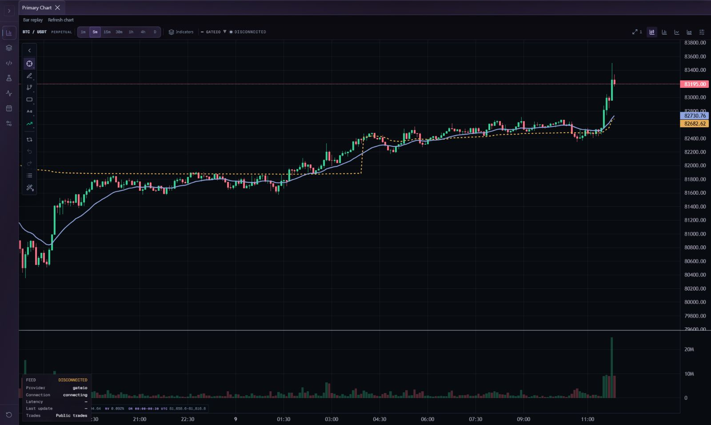
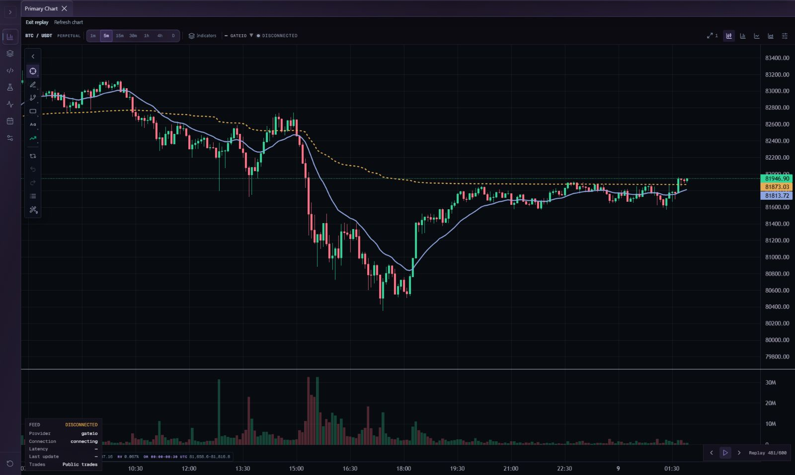
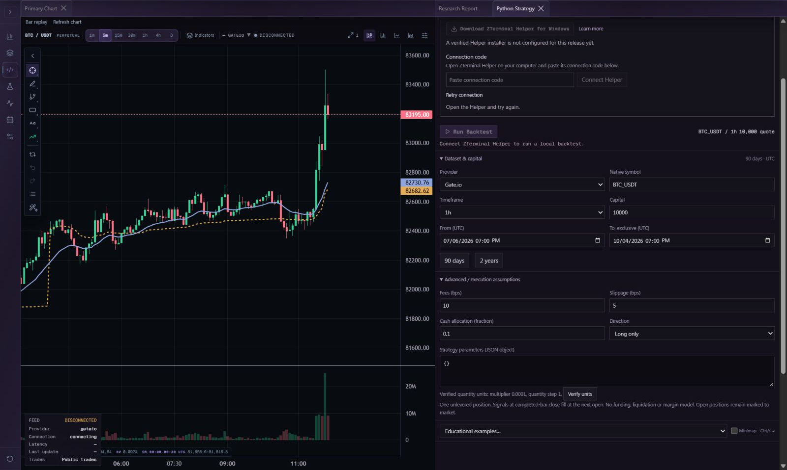

# ZTerminal

### See Further. Guess Less.

**One workspace to understand the market, test your ideas, and build conviction on evidence.**

ZTerminal brings charting, market structure, and quantitative research into one focused trading workspace. Explore what the market is doing, turn observations into testable strategies, and keep the assumptions behind your decisions visible.

  <a href="https://zterminal.dpdns.org/terminal"><strong>Explore the web terminal</strong></a>
  &nbsp;&middot;&nbsp;
  <a href="#the-product">See the product</a>
  &nbsp;&middot;&nbsp;
  <a href="#product-roadmap">Our roadmap</a>
  &nbsp;&middot;&nbsp;
  <a href="#get-started">Run locally</a>

  
  
  
  

Price, studies, and data health in one workspace. Captured from the web beta on October 9, 2026. Historical bars are visible; the streaming feed is disconnected. Windows remains in development.

---

## The product

### Don't just watch the market. Understand it.

A chart can tell you where price went. It cannot, on its own, tell you whether a trading idea stands up to scrutiny.

ZTerminal is being built for the entire process: **observe → investigate → code → test → compare → refine.** Instead of jumping between disconnected charts, scripts, and backtest reports, your research should stay connected to the market data and assumptions that produced it.

| See beyond price | Turn ideas into evidence | Keep control of your research |
| :--- | :--- | :--- |
| Explore charts alongside trade flow, depth-derived signals, indicators, and explicit feed health. | Develop Python research through the private local Helper; evaluate strategies with declared data, costs, and execution assumptions. | Build toward a local-first Windows workstation with durable workspaces, replay, research, and optional cloud sync. |
| **Available in the web beta, subject to feed coverage.** | **Private local research workflow available; integrated desktop workflow is planned.** | **Native desktop foundations exist; complete Windows product is planned.** |

### A closer look

**Study the market. Make the assumptions explicit.** These are actual views from the current [web terminal](https://zterminal.dpdns.org/terminal). Select an image to inspect it at full resolution.

<table>
  <tr>
    <th width="50%" align="left">01 / Study the sequence</th>
    <th width="50%" align="left">02 / Define the test</th>
  </tr>
  <tr>
    <td width="50%" valign="top"></td>
    <td width="50%" valign="top"></td>
  </tr>
  <tr>
    <td valign="top"><strong>Return to the moment.</strong> Replay loaded historical bars alongside EMA, session VWAP, and volume. This capture is a historical study, not a live-feed claim.</td>
    <td valign="top"><strong>Keep the inputs visible.</strong> Inspect the dataset, costs, sizing, and fill assumptions before running research. The local Helper is required to execute a backtest.</td>
  </tr>
</table>

Capture limits: the local Helper was unavailable, the Python code editor remained at its loading state, and no completed backtest report was available. These images show the accessible chart, replay, and research configuration—not a performance result.

---

## What you can explore today

ZTerminal is an evolving **research beta**, not a finished broker-connected trading platform. Here is the practical distinction between implemented foundations and future product goals.

| Area | Current scope |
| :--- | :--- |
| **Chart workstation** | Web-based interactive charting, multi-chart foundations, drawing tools, indicators, and configurable research panels. |
| **Market structure** | Public Binance and Gate market-data paths, sequence-aware order-book handling, observed-trade calculations, large-trade overlays, CVD, footprint foundations, and visible data-health states. Coverage varies by source. |
| **Strategy research** | A private, paired Windows Python Helper with bounded local jobs, result archives, and reproducibility records. It is not an unrestricted hosted Python service or a production sandbox. |
| **Local Windows technology** | A separate Win32/Direct3D prototype, Rust ingestion/storage/replay components, local-scene bridges, and bounded Monte Carlo research experiments. These do **not** yet constitute the complete Windows workstation. |

**Not currently available as a finished product:** native Windows login and cloud sync, a fully integrated desktop research experience, sustained native live market-data operation, public signed Windows distribution, paper-order execution, and real-money automated trading.

> Our standard is simple: **if the data is missing, stale, disconnected, or unverifiable, ZTerminal should say so—not draw a convincing fiction.**

## The research loop

~~~text
Market observation
      ↓
Hypothesis and strategy code
      ↓
Verified dataset + explicit assumptions
      ↓
Local research and backtest
      ↓
Trades, performance, risk, and evidence
      ↓
Change one variable. Test again.
~~~

A useful research tool should make it easier to challenge an idea, not easier to manufacture an impressive equity curve.

- **Know your inputs.** Provider, instrument, period, execution model, costs, and data quality matter.
- **Respect time.** Completed-bar signals do not get to trade on information from the future.
- **Preserve evidence.** Versioned source, dataset identity, configuration, and results make comparisons meaningful.
- **Show uncertainty.** Incomplete histories and broken feeds should be treated as limitations, not silently repaired.

See [Backtesting](docs/BACKTESTING.md) and [Local Research](docs/LOCAL_RESEARCH.md) for the technical contracts.

---

## Product roadmap

### One terminal. A connected research workflow.

**Next: unify the Windows product.** Then strengthen charting, market structure, research, and execution in sequence.

Our long-term goal is to combine the strengths of professional charting, order-flow analytics, and quantitative strategy development in a single web and Windows product. The priorities below describe the **intended order of work**, not announced delivery dates or a claim that these capabilities have shipped.

| Phase | Focus | What success looks like | Status |
| :--- | :--- | :--- | :--- |
| **01 — Unify the Windows product** | Consolidate the legacy desktop shells, real local persistence, startup, offline workspaces, and shared interface contracts. Evaluate a locally bundled React/Tauri shell against continued full-native UI development; keep the Rust core either way. | Open a workspace, load verified data, save, restart, and restore without relying on the website. | **Next priority** |
| **02 — Make charting a daily driver** | Fast multi-chart layouts, drawing tools, configurable studies, synchronized navigation, replay, and saved research arrangements. | Charts feel reliable, precise, and comfortable throughout a real research session. | Planned |
| **03 — Build out market structure** | Sustained direct provider connections, reconnect/recovery, depth integrity, footprint, CVD, volume profile, big trades, and clear data provenance. | Order-flow tools remain useful and honest under real network conditions. | Planned |
| **04 — Complete the quant research loop** | Integrated Python editor, deterministic Rust research, verified datasets, strategy testing, parameter studies, Monte Carlo, comparison, and durable reports. | Move from an observation to a reproducible research record without switching products. | Planned |
| **05 — Validate execution safely** | Paper trading, a risk engine, order-state reconciliation, process recovery, and supervised strategy lifecycles. | Simulated strategies can operate and recover without silent state divergence. | Planned |
| **06 — Earn a production release** | Windows sign-in, optional explicit sync, signed installers and updates; separately gated provider integrations and controlled live execution only after security and risk validation. | A secure, supportable, test-backed Windows product—not an experimental download. | Future |

**Our first milestone:** a genuinely usable local Windows research session—launch → workspace → verified chart → study/strategy → local backtest → save → reopen.

We will prioritize product reliability, research integrity, and trader experience over headline feature counts. Roadmap scope and implementation order can change as real testing exposes better tradeoffs.

### The direction, not a feature checklist

ZTerminal draws inspiration from specialized platforms such as TradingView, ATAS, QuantConnect, QuantPad, and DeepCharts. The aim is **not** a visual clone or a collection of loosely connected features. It is one carefully designed workflow that makes advanced trading research more accessible without hiding complexity that matters.

---

## Under the hood

ZTerminal already contains multiple components. The next engineering challenge is bringing them together into one coherent product.

| Layer | Technology | Role |
| :--- | :--- | :--- |
| **Web workstation** | Next.js, React, TypeScript | Charting, research UI, market exploration, studies, and interactive workflows. |
| **Local market/replay foundations** | Rust | Validated events, local persistence, deterministic processing, and reproducible local research contracts. |
| **Windows native prototype** | Win32, Direct3D 11, C++ | GPU chart experiments, local scene presentation, and measured renderer behavior; not the shipping desktop interface. |
| **Private local research** | Python 3.12, vectorbt, SQLite | Paired loopback research jobs, bounded execution, and archived evidence. |
| **Future Windows shell** | Under architecture review | One cohesive, locally installed interface reusing proven UI and Rust components; no remote-hosted website wrapper as the final product. |

**Security note:** the private Python Helper runs user-provided code with the Windows user's permissions. Pairing and process limits do not make arbitrary Python safe; execute only trusted strategies. See [Security](docs/SECURITY.md).

## Get started

### Explore the web beta

Visit **[ZTerminal Web Terminal](https://zterminal.dpdns.org/terminal)**. Public data availability depends on the provider and region. Development environments may show explicitly labelled simulation data; simulation is never presented as a verified live feed.

### Run the web workstation locally

Requires Node.js (the quality workflow uses Node.js 22) and npm.

~~~powershell
git clone https://github.com/zephyriaa/zterminal.git
cd zterminal
$env:DATABASE_URL = "file:./dev.db"
npm ci
npm run dev
~~~

Open **http://localhost:3000/terminal**.

### Run project checks

~~~powershell
npm run typecheck
npm test
npm run lint
npm run build
cargo fmt --all -- --check
cargo clippy --workspace --all-targets -- -D warnings
cargo test --workspace --all-targets
npm run test:python
~~~

The Python suite requires a compatible Windows CPython 3.12 installation and the Windows Python launcher.

### Private Windows research Helper

Follow the [local research contract](docs/LOCAL_RESEARCH.md). The private Helper build requires the verified embedded CPython 3.12.10 runtime and pinned dependencies prepared under out/research-runtime.

~~~powershell
powershell -ExecutionPolicy Bypass -File research/desktop/build-private.ps1
~~~

This produces a local private archive. It does not publish an installer or enable live trading.

## Release and safety boundaries

- **Web:** Public beta, with feature behavior and feed availability subject to validation.
- **Windows:** Engineering previews and local-first foundations only. No official publicly signed Windows installer is offered here.
- **Broker execution:** Not enabled. The roadmap includes paper trading and eventually separately validated execution, but neither should be inferred from existing credential or adapter foundations.
- **Research risk:** Backtests are hypothetical. Commission, slippage, liquidity, fill assumptions, and gaps in historical data can materially change results.

Public Windows distribution is gated on Windows compatibility testing, publisher signing, hash and release validation, and verified installation/update behavior. See [Windows product boundary](docs/windows/LOCAL_FIRST_PRODUCT_BOUNDARY.md) and [Deployment](docs/DEPLOYMENT.md).

## Documentation

| Explore | Read |
| :--- | :--- |
| **Research** | [Backtesting and execution assumptions](docs/BACKTESTING.md) · [Local research contract](docs/LOCAL_RESEARCH.md) |
| **Market data** | [Market microstructure architecture](docs/MICROSTRUCTURE_ARCHITECTURE.md) |
| **Windows direction** | [Windows local-first direction](docs/windows/LOCAL_FIRST_PRODUCT_BOUNDARY.md) |
| **Security** | [Security and trust boundaries](docs/SECURITY.md) |

## License

ZTerminal is **source-available** under the [ZTerminal Source-Available License 1.1](LICENSE), a custom restrictive license.

- **Permitted:** private, noncommercial research, evaluation, testing, learning, and modification; personal trading, investing, and related research for your own individual account, including for profit.
- **Written permission required:** other commercial use (including use for a firm, employer, or client), redistribution of source or binaries, modified or rebranded versions, and hosting ZTerminal for others—even when offered free of charge.
- **Preserved:** GitHub's platform viewing/forking rights, applicable legal exceptions, and third-party licenses. Earlier MIT-licensed copies retain their existing permissions; the change is not retroactive.

This is not an OSI-approved open-source license. See the [software licensing summary](docs/SOFTWARE_LICENSE.md) for examples and permission requests. Market-data rights are separate and remain governed by the relevant provider agreements.

---

**See Further. Guess Less.**

*Built for the work behind a trading decision.*

