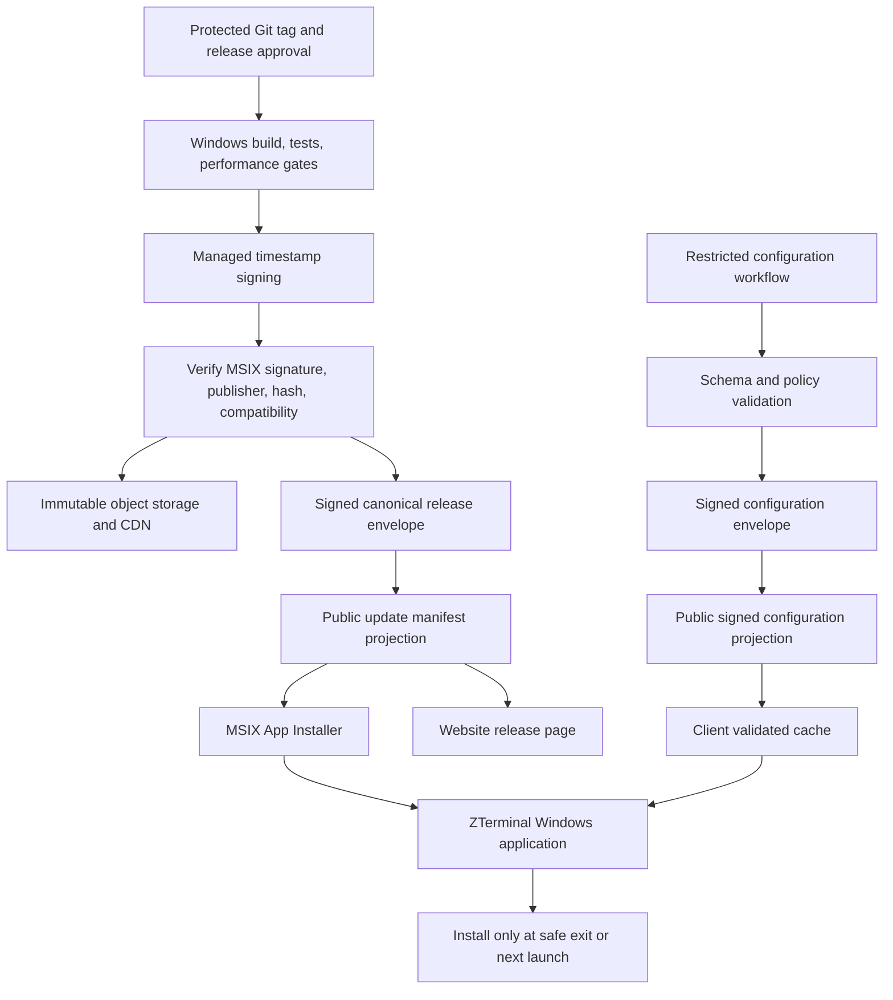
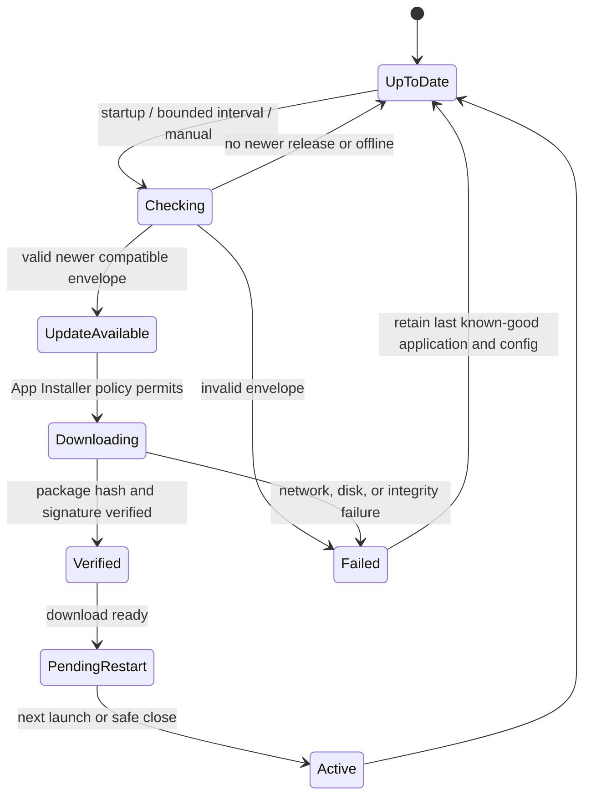

# ZTerminal Live Update, Remote Configuration, and Self-Updating Architecture

**Status:** Architecture proposal. This document deliberately does **not** activate a remote-control service, a public updater, a production signing key, an installer, or a release-control dashboard. The native Windows product is still a Phase 0 Win32/Direct3D host and Rust engine foundation; it has not yet been built or tested on Windows hardware.[1]

## Executive decision

ZTerminal should use **two separate, signed control planes**. The first is a binary-release plane that distributes immutable, timestamp-signed MSIX packages through an App Installer channel. The second is a deliberately narrow remote-configuration plane that carries signed, typed, versioned policies and feature flags. Neither plane is allowed to execute remotely supplied code, alter broker authority, manufacture market data, bypass account controls, or make startup dependent on network access.

The production recommendation is to start with signed MSIX plus App Installer for installation, ordinary updates, repair, stable/beta channels, and update fallback URIs. Microsoft documents App Installer update and repair support for Windows 10 version 2004 and later and all Windows 11 versions; it can check on launch, use configurable intervals, and use fallback update URIs.[2] A custom side-by-side binary launcher is **not** the first implementation. It adds a second package installer, another privileged trust boundary, and significantly more rollback risk before the native terminal has a shipping build. It becomes a later evaluation only if the MSIX/App Installer path proves unable to meet measured product requirements.

> **Core rule:** remote configuration changes safe, predeclared behavior; signed binary packages change executable code. An update service outage, config outage, invalid envelope, or update download failure must never prevent the installed terminal from launching with compiled defaults and its last valid local state.

## Current constraints and architectural implications

| Existing condition | Implication for this design |
| --- | --- |
| Native host is a Windows-only Phase 0 spike, not a packaged app. | No updater, remote config, launch watchdog, or installer may be represented as live today. |
| The current public release route is fail-closed. | Every update-control endpoint extends the same canonical release envelope; no second hand-maintained version source is introduced. |
| Render is a lightweight web service and current cloud persistence is unverified. | Render may project small metadata but must not host binaries, signing keys, authoritative release history, or high-frequency per-client rollout decisions. |
| Google/Auth.js and workspace sync are gated. | Update discovery stays public and anonymous; future desktop sign-in uses OAuth/OIDC with PKCE but is not required to check a public update. |
| The product is research-only and public-market-data oriented. | Update/config policy cannot enable trading, brokers, account balances, order routing, or untrusted provider fallback. |

## Target architecture



The CI release workflow owns the canonical record. Object storage/CDN hosts only immutable artifacts, signed release/configuration envelopes, App Installer files, and public release notes. The website reads a constrained projection. The Windows client validates the release and configuration envelope before use; it never trusts a URL merely because it arrived via HTTPS.

## Technology choices

### Binary installation and update mechanism

| Approach | Performance and Windows compatibility | Security and rollback | Complexity and maintenance | Suitability |
| --- | --- | --- | --- | --- |
| **MSIX + App Installer** | Native Windows deployment with update/repair capability on Windows 10 version 2004+ and Windows 11.[2] | Windows validates package signing; App Installer supports fallback update URIs. Channel promotion can halt new adoption quickly. | Lowest operational complexity for the first public release. | **Recommended baseline.** |
| Custom bootstrapper plus side-by-side application folders | Maximum control over download scheduling, A/B versions, watchdog rollback, and delta algorithms. | Requires a secure privileged updater, local directory hardening, trusted launcher, explicit anti-downgrade rules, and extensive power-loss testing. | High; creates a second installer and recovery surface. | Defer until MSIX limitations are demonstrated on measured Windows builds. |
| Microsoft Store | Store handles distribution/update mechanics and package signing. | Strong distribution trust but introduces store policy/certification and release-process control. | Moderate operational effort, less release control. | Consider as an additional channel after native packaging works; do not make it a prerequisite. |

MSIX packages require a valid trusted code-signing certificate, and timestamping preserves validation after certificate expiry.[3] Production signing must use a managed signing service or protected organizational signing flow, never a private key in Git, Render, desktop code, or general developer workstations.

### Background transfer and differential updates

The baseline installer/update path uses App Installer, not a parallel custom downloader. If ZTerminal later proves that background full-package transfer needs more control, the custom updater can evaluate BITS. BITS is designed for HTTP/SMB background transfers, preserves foreground network responsiveness, and resumes after disconnects or reboot.[4] It is not added prematurely because a second update path must independently validate the same hash, signature, publisher, version, policy, cache cleanup, and recovery conditions.

| Option | Bandwidth efficiency | Reliability | Decision |
| --- | --- | --- | --- |
| Full signed MSIX package | Lowest implementation risk; package may be larger. | Straightforward verify/retry/reinstall behavior. | Use first. |
| Differential/binary patch | Potentially saves bandwidth for large package deltas. | Higher corruption, patch-compatibility, rollback, and test complexity. | Defer until real package size, download telemetry, and update frequency justify it. |
| Independently updateable modules | Can reduce package size for safe data/visual assets. | Dangerous for native code unless sandboxing, signing, compatibility, quotas, and rollback exist. | No remote native modules; consider versioned signed WASM/data packages only after core updater maturity. |

## Canonical version manifest

The release envelope extends the existing record rather than replacing it. CI emits it after signing, verification, upload, and release approval. The website receives a safe projection; the Windows client receives the signed envelope and independently validates it against the embedded public key and package publisher policy.

```json
{
  "schema_version": 2,
  "release_id": "windows-x64-stable-1.0.0+20260823.1",
  "state": "published",
  "channel": "stable",
  "platform": "windows",
  "architecture": "x64",
  "version": "1.0.0",
  "build_number": 1,
  "published_at": "2026-08-23T00:00:00Z",
  "minimum_supported_version": "1.0.0",
  "mandatory": false,
  "mandatory_reason": null,
  "minimum_windows_build": 19041,
  "protocol_version": 1,
  "config_schema_version": 1,
  "local_data_schema_version": 1,
  "package": {
    "url": "https://downloads.example/ZTerminal-1.0.0.msix",
    "bytes": 123456789,
    "sha256": "hex-encoded-sha256",
    "publisher_subject": "expected X.509 subject",
    "timestamp_required": true
  },
  "appinstaller": {
    "url": "https://downloads.example/stable.appinstaller",
    "fallback_urls": ["https://fallback.example/stable.appinstaller"]
  },
  "release_notes_url": "https://zterminal.onrender.com/docs/windows/releases/1.0.0",
  "rollback_policy": { "allow_local_known_good": false, "blocked_versions": [] },
  "signature": { "algorithm": "ed25519", "key_id": "zt-release-2026-01", "value": "base64-signature" }
}
```

The client rejects an envelope if its schema, signature, expiry policy, channel, platform, architecture, semantic version, minimum OS, package host, publisher subject, digest, required timestamp, protocol version, or data-schema compatibility is invalid. It also rejects a lower version unless a locally stored **known-good rollback authorization** explicitly permits that exact rollback target. No server response alone may silently downgrade an installed terminal.

## Release lifecycle, channels, and rollout

The initial release states are `draft`, `testing`, `canary`, `healthy`, `stable`, `degraded`, `blocked`, `retired`, and `rolled_back`. Stable, beta, and internal channels each have independent signed channel pointers. A user may opt into beta locally; internal is not publicly discoverable. The selected channel is local user state, but a security block can override it only through a signed mandatory policy.

The first rollout capability is **channel promotion and central pause**, not a percentage claim. A valid App Installer channel pointer can update the stable or beta package reference, while pausing/rolling back a pointer stops new downloads. Percentage rollout requires a separate deterministic decision layer. When introduced, the client will create a random installation identifier and store it with OS-backed protection; the rollout service uses a server HMAC of that opaque identifier and release ID to assign a stable bucket. The response may be a tiny signed decision object with no account identity. This preserves deterministic cohorts without placing identity or market data in update requests.

| Rollout stage | Admission rule | Automatic response |
| --- | --- | --- |
| Testing | Internal signed build only. | Block external download. |
| Canary | Explicit beta/internal cohort or 1% deterministic device bucket. | Pause if defined launch/update failure thresholds breach. |
| Healthy | Measured success criteria met through the observation window. | Promote deliberately to the next percentage. |
| Stable | 100% of stable channel. | Continue monitoring; retain prior release metadata. |
| Degraded/blocked | Signature, crash, update, launch, or data-integrity incident. | Stop new adoption immediately; remote kill switch may disable an affected optional feature. |

Health automation is a later service, not an unreviewed cron job. It should operate on privacy-minimized aggregate counters and hard-coded, reviewed thresholds. A pause action must be reversible and audited; only signing/publishing is a release authorization, while a pause may be authorized by an on-call release manager.

## Remote configuration and feature-flag control plane

Remote configuration is a **small typed policy document**, not a JavaScript object that can control arbitrary behavior. Every key is declared in the desktop source tree and is tagged with type, default, bounds, feature owner, expiry, compatibility range, precedence, and safe fallback. Unknown keys, duplicate keys, expired emergency policy, invalid values, or values outside bounds are ignored and reported as a local non-sensitive diagnostic event.

```json
{
  "schema_version": 1,
  "config_version": 1,
  "issued_at": "2026-08-23T00:00:00Z",
  "expires_at": "2026-08-30T00:00:00Z",
  "minimum_client_version": "1.0.0",
  "maintenance": { "market_data_status": "available", "message": null },
  "flags": {
    "ui.orderflow_preview": { "value": false, "owner": "desktop", "expires_at": "2026-12-31T00:00:00Z" }
  },
  "defaults": {
    "orderflow.large_trade_threshold": 50000,
    "chart.timezone": "exchange"
  },
  "signature": { "algorithm": "ed25519", "key_id": "zt-config-2026-01", "value": "base64-signature" }
}
```

The initial allowlist is limited to display defaults, safe feature visibility, maintenance/degraded-state notices, non-secret endpoint aliases, supported market-data presentation thresholds, and telemetry sampling set to zero by default. It does **not** include authentication settings, OAuth endpoints, code/module URLs, broker/order permissions, filesystem paths, arbitrary network hosts, database migration instructions, execution commands, provider fallback, or account entitlements.

Configuration precedence is: compiled safety defaults → validated local user preferences → validated signed remote defaults → validated signed kill-switch policy. A remote policy can override a user preference only where the key’s source definition explicitly marks it as an emergency-safe mandatory policy, such as hiding a known-crashing experimental renderer. Every override is visible in diagnostic state and audit records.

The client refreshes configuration on startup, after a long offline interval, and on a bounded periodic cadence such as 15 minutes. An existing authenticated market/control socket may later carry a `config-version-changed` hint, but it merely triggers an ordinary signed configuration fetch; it never carries executable configuration directly. For emergency disable and maintenance notices, a minimum one-minute signed refresh is considered only after measured traffic and cost evaluation. The local precedence is valid remote → valid cached remote → compiled defaults. An unavailable service never blocks startup.

## Update manager, restart safety, and recovery

The initial update manager is an **App Installer-backed lifecycle coordinator** inside the desktop application, not a self-replacing executable. It shows state, knows the selected channel, performs compatibility checks, records approved restart policy, and exposes manual “check for updates” control. Package replacement remains in the Windows-supported MSIX/App Installer flow.



A binary install must never restart the application during active chart interaction or future trading-sensitive activity. ZTerminal currently has no broker execution; nonetheless the manager will treat a replay session, workspace changes, ongoing research, market reconnect, or future open-order state as a reason to defer installation. The normal user experience is: **download quietly, notify once, install when the app closes or on the next launch**. Mandatory updates are exceptional and need a signed reason, compatibility rationale, and user-facing explanation.

The MSIX baseline does not promise automatic binary downgrade after a runtime crash. Instead, it immediately stops the faulty release’s channel promotion, displays a safe-mode notice, uses remote kill switches only for predesigned optional features, and retains local diagnostics. Automatic binary rollback requires a separately engineered signed bootstrapper/side-by-side strategy with protected directories, startup watchdog, database backup/restore, known-good version storage, and power-loss tests. That work is deferred until there is a production native package and a measured reason to accept its risk.

Local user data remains outside replaceable program files. Before any local data-schema migration, the client records schema version, creates a bounded backup, migrates, validates, and restores the backup if validation fails. A binary rollback cannot be considered valid unless its data-schema compatibility was checked first.

## Trust, privacy, and operations model

The client trust chain is explicit: an embedded release/configuration public key → signed release/config envelopes → allowlisted HTTPS artifact locations → timestamp-signed MSIX package → expected publisher subject → exact SHA-256 → compatibility and anti-downgrade policy. HTTPS protects transport but does not replace envelope or package verification. A key rotation envelope needs dual-signature or old-key authorization and is never delivered through an unverified configuration field.

Update discovery sends only product name, current semantic version, channel, platform, architecture, protocol version, and—only once staged rollout exists—an opaque protected installation cohort token. It does not require account login, chart symbols, workspaces, market data, device serial number, hardware fingerprint, or personal data. Telemetry remains opt-in and aggregated: availability, download start/complete, verification failure category, install failure category, successful first launch, safe-mode entry, and rollback request. A download click is not an install, and a crash report is not a reason to automatically roll back without a confidence threshold.

| Role | May do | Must not do |
| --- | --- | --- |
| Developer | Create a candidate build and test it. | Publish stable, rotate signing keys, or change critical policy alone. |
| Release manager | Promote/pause a signed approved release under audit. | Sign a package or alter configuration schemas. |
| Configuration manager | Publish an already schema-validated safe policy. | Add new key classes, change trust anchors, or enable code modules. |
| Security administrator | Manage signing integration, key rotation/revocation, and emergency security blocks. | Modify ordinary product settings without the applicable review. |

The first administration interface is protected GitHub environments, protected tags, mandatory approvals, signed CI output, and audit logs. A database-backed internal dashboard is deferred until durable production storage, identity, role control, and audit retention have been proven. It must not be built on the current unverified cloud-sync database path.

## CI/CD and operational workflow

1. A protected release tag creates an internal candidate and runs Rust, web, protocol, installer, and Windows hardware acceptance checks.
2. A protected signing environment signs and timestamps the package; CI verifies signature, certificate chain, publisher, hash, package identity, and App Installer metadata.
3. CI uploads immutable artifacts and generated channel pointers to the approved storage/CDN and creates a signed canonical release envelope.
4. A release manager promotes the verified candidate to internal, beta/canary, then stable only after the required health window. No production file is manually edited.
5. A pause changes the signed channel pointer to stop new adoption; emergency feature mitigation uses a separately signed, predeclared remote kill switch; recovery is documented and audited.

Render continues to serve web pages and, only if proven adequate, cached metadata projections. It does not host packages, signing keys, dynamic per-device rollout logic, or raw event streams. A proper controlled storage/CDN and signing provider require explicit operator approval because they can carry billing, identity-verification, and security-administration commitments.

## Delivery sequence and gates

| Phase | Deliverable | Required gate |
| --- | --- | --- |
| 0 | Windows host build, renderer measurement, native package identity, and real system requirements. | A real Windows 10/11 build machine and passed reference hardware benchmark. |
| 1 | Signed MSIX/App Installer prototype, canonical manifest v2 schema, stable/beta channel pointers, manual check UX, and no public release. | Explicit signing/storage approval and a test certificate only for internal Windows testing. |
| 2 | Fresh install, upgrade, repair, fallback URI, package rejection, offline launch, and channel pause test matrix. | Signed package and controlled staging storage. |
| 3 | Remote config schema v1, client cache, defaults, safe feature flags, maintenance state, and signed config validator. | Review of every allowed key and durable release/config publication record. |
| 4 | Native update lifecycle coordinator, safe-close install preference, opt-in aggregate telemetry, and controlled beta. | Successful staged Windows testing; privacy notice and telemetry decision. |
| 5 | Deterministic percentage rollout, aggregation, canary health pause, and internal role/audit surface. | Durable database, identity/roles, measured cohort load, and an approved on-call procedure. |
| 6 | Evaluate custom bootstrapper, BITS transfer, delta packages, or modular signed extensions only if data proves the MSIX baseline inadequate. | Security review, power-loss/rollback tests, and explicit acceptance of added maintenance burden. |

## Test and failure matrix

The initial acceptance suite must simulate a valid upgrade, interrupted network, corrupt package, invalid publisher/signature, invalid/expired release envelope, unavailable update service, invalid remote config, offline startup, full disk, duplicate instance/update lock, failed local-data migration, version-protocol mismatch, upgrade-to-safe-restart transition, channel pause, and remote feature disable. Windows tests run on the declared supported build baseline and use a physical Windows environment for Direct3D/installer evidence.

Chaos tests follow only after the baseline is stable: process termination during download, power-loss simulation before/after package verification, stalled CDN, stale cache, invalid fallback URI, abandoned lock, device-restart during transfer, and regression of a prior known-good configuration. The expected outcome is always a usable last-known-good application and clear truthful status, never silent execution of a downloaded file.

## Scalability and cost posture

Public release and configuration documents are tiny, cacheable, signed envelopes with ETags, `Cache-Control`, and conditional fetches. Immutable binary transfer belongs to CDN/object storage, not Render. Normal clients check on startup and at a bounded interval; an outage uses cache/defaults rather than retry storms. This design keeps the update path low-cost for free users and supports large populations without placing their desktop computation, market analysis, or package download traffic on the application server.

The lighter starting option is protected GitHub release assets and manually promoted stable/beta pointers for internal/beta testing. The production option is controlled object storage/CDN plus managed code signing and an audited release/config ledger. The first option minimizes setup; the second provides the stronger control, cache, rollback, and operational separation needed for an external product. Neither is enabled by this proposal.

## References

[1]: https://github.com/zephyriaa/zterminal/blob/main/docs/windows/PHASE0_DECISION_RECORD.md "ZTerminal Phase 0 Decision Record"

[2]: https://learn.microsoft.com/en-us/windows/msix/app-installer/auto-update-and-repair--overview "Microsoft Learn: Auto-update and repair apps"

[3]: https://learn.microsoft.com/en-us/windows/msix/package/signing-package-overview "Microsoft Learn: Sign an MSIX package"

[4]: https://learn.microsoft.com/en-us/windows/win32/bits/background-intelligent-transfer-service-portal "Microsoft Learn: Background Intelligent Transfer Service"
