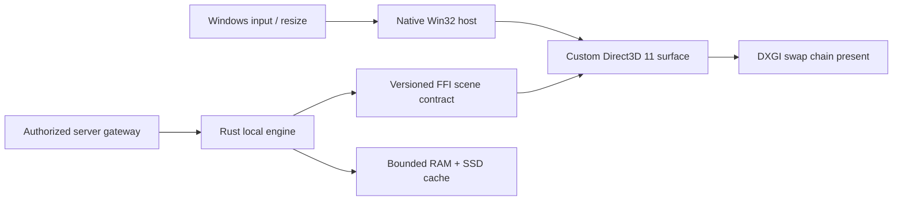

# ZTerminal Windows Local-First Desktop — Phase 0 Decision Record

**Status:** Conditional architectural approval with first Windows evidence. The portable engine, protocol, cache-policy, and benchmark foundations are implemented and validated. The native Windows renderer host now compiles, launches, and records hardware Direct3D diagnostics on one connected Windows 10 reference machine. It is still a Phase 0 spike rather than a terminal: no candles, local persistence, provider connection, Rust scene contract, Windows App SDK chrome, or production package exists yet.

## Decision

ZTerminal will pursue a **native Windows host plus a Rust local engine**. The existing Tauri/WebView desktop prototype remains in the repository as a historical prototype only; it is not the flagship terminal path and must not become a wrapper around the deployed web application.

The first native host spike is a minimal Win32 + Direct3D 11 application. It establishes native window, resize, keyboard, device-fallback, swap-chain, and present-loop behavior without a browser renderer. The production host will add Windows App SDK / WinUI 3 controls for accessible application chrome and workspace management while retaining a custom native GPU chart surface. WinUI 3 supports Windows 10 version 1809 and later, providing the planned Windows 10/11 baseline.[1]

> The Phase 0 decision is **not** evidence that the Windows terminal is faster than the web terminal. That claim requires the Windows reference-machine measurements listed below. The portable Linux results demonstrate algorithmic behavior only; they do not measure Direct3D, Windows input latency, GPU time, process working set, installer size, or a real market-data provider.

## Implemented foundation

| Component | Location | Delivered behavior |
| --- | --- | --- |
| Versioned normalized contract | `crates/zt-protocol` | Provider, environment, data-status, stream sequence, symbol-ID, integer tick, quantity, and input validation types. |
| Local data engine | `crates/zt-core` | Bounded sequence tracking, duplicate rejection, explicit gap detection, observed-only bar aggregation, and incremental EMA. |
| Local cache policy | `crates/zt-storage` | Configurable byte budget, provenance metadata, O(log n) LRU access/eviction index, and explicit local/sync status types. |
| Fixture contract | `packages/contract-fixtures` | Deterministic simulation-only contiguous and gap vectors for TypeScript/Rust parity work. |
| Benchmark executable | `apps/desktop-phase0-cli` | Deterministic fixture-only ingestion, aggregation, and cache-index benchmark with JSON output. |
| Native host spike | `apps/windows-host` | Win32 window and Direct3D 11.1-compatible swap chain; no WebView, market-data connection, cloud sync, or order routing. |

The local engine derives bars only from observed trades. A duplicate is ignored rather than counted twice, and a sequence discontinuity marks the active bar as `Gap` instead of inventing filler events or bars. This preserves the existing no-synthetic-data posture.

## Portable benchmark record

The benchmark uses deterministic, explicitly labelled `Provider::Fixture` and `Environment::Simulation` events. It is a microbenchmark for local algorithm and cache-index behavior, not a production capacity estimate. Each event uses a 10 microsecond fixture timestamp increment, which exercises bar boundaries without representing a real provider feed.

| Run | Events | Ingestion elapsed | Ingestion rate | Completed observed bars | Cache index elapsed | Retained cache | Evictions |
| --- | ---: | ---: | ---: | ---: | ---: | ---: | ---: |
| Linux fixture 100k | 100,000 | 0.790 ms | 126.60 M events/s | 1 | 36.201 ms | 32 MiB / 65,536 entries | 34,464 |
| Linux fixture 1m | 1,000,000 | 7.751 ms | 129.01 M events/s | 10 | 34.825 ms | 32 MiB / 65,536 entries | 34,464 |

The initial cache-index implementation scanned all retained segments at each eviction and took approximately 14 seconds for the same 100,000 insertion workload. The Phase 0 benchmark exposed this quadratic behavior before production use. It was replaced with a `HashMap` plus ordered access index, reducing the recorded 100,000-segment cache path to 36.201 ms in this environment. The result demonstrates why benchmark-driven resource design is mandatory; it is not a promised end-user performance figure.

## Native renderer spike design

The current spike presents an empty dark render surface only. Its purpose is to establish a clean native rendering boundary before candles, drawing tools, text shaping, profiles, and order-flow graphics are introduced. A fallback WARP driver can make the spike function on unsupported hardware, but WARP measurements are invalid for GPU acceptance criteria.

| Native-host item | Phase 0 state | Next verification |
| --- | --- | --- |
| Actual Win32 window | Built and launched on one Windows 10 x64 machine. | Repeat on declared integrated, mid-range, and discrete-GPU reference tiers. |
| Hardware Direct3D 11 device | Verified on NVIDIA GeForce 710M at feature level 11.0; WARP was not selected. | Record selected adapter/feature level on every reference tier and reject WARP as a performance pass. |
| Swap chain, resize, present loop | Idle present-loop benchmark recorded; 20 two-second hardware runs reported median/p95 frame timing. | Add resize, input-to-present, device-reset, and chart-scale workload evidence. |
| WinUI 3 application chrome | Design decision only | Add after native surface benchmark establishes a viable overhead budget. |
| Direct3D 12 renderer | Deferred comparator | Prototype only if D3D11 results miss the chart workload budget. |
| Custom chart primitives | Deferred | Implement after a validated host and engine-to-renderer scene contract. |

## First Windows host evidence

The first real Windows host build used the local MSVC 19.44 toolchain, Windows SDK 10.0.26100, and CMake configuration. The benchmark executable was built from `apps/windows-host`, launched in an automated two-second mode 20 times, and wrote a local JSON diagnostic record for each run. The committed source now includes that diagnostic mode and the reproducible `apps/windows-host/scripts/run-phase0-benchmark.ps1` runner.

| Attribute | Recorded value |
| --- | --- |
| Operating system | Windows 10 Home x64, build 19045 |
| Reference hardware | Intel Core i3-3110M, 2 cores / 4 logical processors, 3.88 GiB installed memory |
| Active GPU | NVIDIA GeForce 710M, 1 GiB reported adapter memory, driver 21.21.13.7654 |
| Feature level / driver path | Direct3D 11.0 / hardware; no WARP fallback |
| Display / power plan | Intel display output at 1366×768, 60 Hz / Revision – Ultra Performance |
| Launch to visible | 91.039 ms median; 99.501 ms p95 across 20 automated launches |
| Idle present-loop frame p95 | 17.157 ms median; 17.252 ms worst recorded run |
| Process working set | 25,812,992 bytes median; 25,841,664 bytes p95 |
| Process private usage | 31,936,512 bytes median; 31,997,952 bytes p95 |

The result is a **native-host smoke and idle baseline**, not a terminal performance claim. It contains only an empty dark render target; it does not measure input-to-present latency, resize, candles, text, drawings, local storage, engine workers, chart datasets, provider load, or long-session memory pressure. The first maximum frame outlier was 57.264 ms on one run, so even the empty renderer needs deeper frame-histogram and interaction analysis before accepting a 60 FPS user-experience target. The raw 20-run summary is retained in `docs/windows/benchmarks/windows-phase0-summary.json`.

## Required Windows benchmark protocol

The Windows spike must be executed on three declared reference tiers: an integrated-GPU low-resource computer, a mid-range x64 machine, and a discrete-GPU high-end machine. Each report must state Windows build, CPU, RAM, GPU, driver, monitor resolution/refresh rate, power mode, executable configuration, and whether WARP was selected.

| Measurement | Acceptance target | Collection rule |
| --- | --- | --- |
| Cold startup | Less than 2 seconds on mid-range reference hardware where practical | Median and p95 across at least 20 cold launches. |
| Warm startup | Less than 1 second where practical | Median and p95 across at least 20 warm launches. |
| Baseline memory | 150–250 MiB idle target | Private bytes and working set after a stable idle period. |
| Rendering | 60 FPS normal interaction; 120 FPS when hardware supports it | Frame-time histogram, not an average only. |
| Interaction | No visible block during pan/zoom/crosshair | Capture input-to-present latency while engine workers are active. |
| Dataset scale | 10k, 100k, and 1m plot points | Record frame time, GPU time, CPU time, and memory. |
| Resource safety | Bounded under long sessions | Two-hour then eight-hour soak with cache-quota and memory-pressure events. |
| Failure behavior | Truthful degraded state | Disconnect, duplicate, gap, stale, malformed frame, device-reset, and WARP fallback tests. |

## Security and data-integrity guardrails

The desktop foundation does not contain an authentication implementation, market-provider credential, Google client secret, database credential, broker capability, real account data, order-routing interface, or cloud-sync activation path. Any future desktop sign-in must use system-browser OAuth with PKCE and Windows-backed credential storage. Server-side authorization remains authoritative for entitlement, sync, provider access, and privileged services.

The desktop data contract makes `provider`, `environment`, `data_status`, and sequence metadata part of every normalized event. The engine rejects invalid quantities/prices, ignores duplicates, reports gaps, and refuses to create missing data. The client is permitted to compute from verified inputs locally, but it is not trusted to authorize itself or to claim a feed is live.

## Phase 0 validation record

| Check | Result |
| --- | --- |
| Rust formatting | Passed with `cargo fmt --all -- --check`. |
| Rust unit tests | Passed: 9 tests across protocol, engine, and cache modules. |
| Rust linting | Passed with `cargo clippy --workspace --all-targets -- -D warnings`. |
| Portable release benchmark | Passed and recorded in `docs/windows/benchmarks/`. |
| Linux build of Windows host | Not applicable; host is correctly blocked outside Windows. |
| Windows Direct3D host build | Passed on the connected Windows 10 x64 machine with MSVC 19.44 and Windows SDK 10.0.26100. |
| Windows Direct3D runtime test | Passed hardware smoke and 20-run idle baseline on NVIDIA GeForce 710M; resize, input, chart-scale, device-reset, and soak tests remain pending. |
| Windows benchmark evidence | Saved as `docs/windows/benchmarks/windows-phase0-summary.json`; reproducible runner saved as `apps/windows-host/scripts/run-phase0-benchmark.ps1`. |
| Web regression suite | Pending final Phase 0 integration check; the existing web app is unchanged by the new Rust workspace. |

## Immediate next engineering slice

The Windows-host build and initial idle measurement are complete. The next slice is a thin Rust FFI scene contract and a 10k/100k local candle renderer, with resize/input/device-reset instrumentation and the remaining reference-tier test matrix. In parallel, the existing TypeScript aggregation and deterministic indicator outputs should be converted into shared golden fixtures so each Rust port is verified before the web implementation is retired.

Cloud synchronization remains postponed. The existing production environment has not demonstrated a durable managed database or a provider-correct migration path, and the Windows client must treat local state as the source of truth until server acknowledgement is real and ownership isolation is tested.

## References

[1]: https://learn.microsoft.com/en-us/windows/apps/winui/winui3/ "Microsoft Learn: WinUI 3"

[2]: https://learn.microsoft.com/en-us/windows/apps/windows-app-sdk/ "Microsoft Learn: Windows App SDK"

[3]: https://learn.microsoft.com/en-us/windows/apps/package-and-deploy/deploy-overview "Microsoft Learn: Windows App SDK deployment overview"
