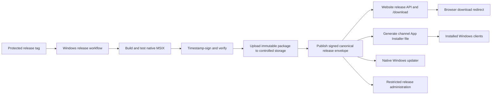

# ZTerminal Website-to-Windows Distribution Proposal

**Status:** Architecture proposal and release gate definition. This document does not authorize a public installer download yet. The repository currently produces unsigned Tauri NSIS/MSI workflow artifacts, while the approved native Windows host is only a Phase 0 spike and has not been compiled or measured on Windows. Neither output is eligible to be presented as an official public installer.

## Current-state assessment

ZTerminal currently uses Next.js 16 for the landing page and terminal, Auth.js for a deliberately gated Google identity foundation, a Docker/Render web deployment, and a GitHub Actions quality workflow. The public landing page is implemented in `src/components/landing/landing-page.tsx`; all present public CTAs lead to `/terminal` or on-page sections. There is no `/download` page, release API, installer CDN, release manifest, code-signing stage, updater configuration, desktop login handoff, release dashboard, or download funnel.

The existing `windows-desktop` job in `.github/workflows/quality.yml` creates **unsigned** NSIS and MSI artifacts from the legacy Tauri prototype. The newer native direction is a Win32/Direct3D host with a Rust data engine; it has no package output yet. The current Auth.js route returns no provider until durable storage and Google configuration gates are satisfied. Therefore the website must not claim that users can presently download, sign into, auto-update, or use an official Windows application.

> **Release truthfulness gate:** a `Download for Windows` button may start a file download only after an x64 package has passed Windows acceptance tests, been timestamp-signed, had its signature and hash verified in CI, and been published with a valid canonical release record. Until then, website UI may describe the Windows application as in development and offer the web terminal as the available product.

## Recommended release model

ZTerminal should keep one canonical, signed **release envelope** per platform/channel. CI creates the envelope only after build, test, benchmark, signing, verification, hash calculation, and upload succeed. The website reads it to display release status and route downloads. The Windows installation/update mechanism reads artifacts derived from the same record. The release manager never edits a landing-page string, redirect URL, or installer file manually.



The canonical record contains a schema version, release ID, semantic version, channel, x64 architecture, package URL, package SHA-256, bytes, publication timestamp, minimum supported version, release-notes URL, signer identity, and explicit state (`draft`, `published`, `paused`, or `rolled_back`). It does **not** contain a private signing key, cloud credentials, OAuth secret, provider credential, or database secret. The record is signed as an opaque envelope with an Ed25519 public key embedded in the Windows application and configured on the website server. The server must reject an unsigned, invalid, malformed, wrong-channel, non-HTTPS, or non-allowlisted-host envelope.

## Distribution choices requiring an operator decision

The website code can be made storage-provider agnostic now, but an actual public artifact location must be selected before a signed release exists. The choice changes operational cost, retention controls, and release automation; it must not be guessed or provisioned without approval.

| Approach | Tradeoffs | Cost | Setup complexity |
| --- | --- | --- | --- |
| Controlled GitHub Release assets for an internal/beta pilot | Fastest because the repository already uses GitHub Actions; less control over CDN behavior, regional delivery, and enterprise distribution. | Usually low at pilot scale; verify current GitHub policy before public heavy use. | Low. |
| Dedicated object storage plus CDN under a ZTerminal-controlled download domain | Best production control over immutable objects, cache headers, redirects, retention, global delivery, and fallback. Requires a paid account, DNS, access policy, and release credentials. | Variable storage, egress, and CDN costs. | Medium. |
| Microsoft Store distribution | Store handles package signing and update distribution, but adds store certification, policy, and release-process constraints. | Store signing is available through submission; operational terms still apply. | Medium to high. |

The implementation recommendation is **provider-neutral release metadata plus an initially private/beta object-store or GitHub-asset source**. Move to a dedicated download domain/CDN only after the operator explicitly approves a storage provider, billing model, and signing service. No paid resource will be created by this proposal.

## Website changes

The public website will add a first-class desktop discovery flow without slowing the landing page or hardcoding a file URL.

| Surface | Change | Release-state behavior |
| --- | --- | --- |
| `/` landing page | Add a Windows-app product strip and primary desktop CTA beside the existing web-terminal path. | If no eligible release exists, show **Windows app in development** and a web-terminal CTA; do not emit a fake download. |
| `/download` | New accessible Windows download hub with version, channel, system requirements, checksum, release notes, installation steps, security/publisher guidance, and web fallback. | Server/client requests the release API; unavailable and non-Windows states keep the web terminal usable. |
| `/download/windows` | Stable routing endpoint. | Redirect only to a verified, allowlisted HTTPS artifact URL; otherwise return a truthful unavailable response. |
| `/api/releases/windows` | Cacheable public metadata response. | Exposes only a safe public projection of the validated release record; no storage secrets or internal rollout data. |
| `/docs/windows/install` | Installation, update, uninstall, signature-verification, recovery, and troubleshooting guide. | Documents only released installer formats and verified system requirements. |
| Landing/page analytics | Optional privacy-minimized CTA/download-page events. | A click is never recorded as an install; install/launch/login require explicit client-side opted-in telemetry. |

The initial landing copy must not state unsupported performance or installation claims. It may truthfully say: **“ZTerminal for Windows is being prepared as a native local-first desktop terminal. Use the web terminal today.”** Once the signature and acceptance gates pass, the message may change to **“Download ZTerminal for Windows”** and state only measured capabilities, such as Windows version and x64 support.

## Release and download API contract

The public API is a projection, not the source of authority. It returns only a published, verified release or an explicit unavailable state. It will be versioned under `/api/releases/windows` and set conservative shared-cache headers such as `s-maxage=60, stale-while-revalidate=300`; release publication invalidates the CDN key deliberately.

```json
{
  "schema_version": 1,
  "available": true,
  "platform": "windows",
  "architecture": "x64",
  "channel": "stable",
  "version": "1.0.0",
  "download_url": "https://downloads.example/ZTerminal-Setup-1.0.0.msix",
  "appinstaller_url": "https://downloads.example/stable.appinstaller",
  "sha256": "hex-encoded-sha256",
  "size_bytes": 123456789,
  "published_at": "2026-08-23T00:00:00Z",
  "release_notes_url": "https://zterminal.onrender.com/docs/windows/releases/1.0.0",
  "minimum_supported_version": "1.0.0"
}
```

When no release passes validation, the response returns `available: false` with a user-safe reason such as `NO_SIGNED_WINDOWS_RELEASE`. The endpoint never redirects blindly to a URL supplied by the browser, never exposes an unsigned artifact, and never advertises an untested ARM64 build.

## Installer and update strategy

The current NSIS/MSI output is a legacy **internal artifact path** only. The production native release path will be a signed MSIX package plus an `.appinstaller` file, generated in CI from the same canonical release record. Microsoft documents that App Installer auto-update and repair use the App Installer URI, support fallback `UpdateURI` values, and are available on Windows 10 version 2004 and later and Windows 11.[1] The product compatibility label must therefore be split carefully: the native host can target Windows 10 version 1809+, while built-in App Installer auto-update is only claimed for the documented update-compatible baseline unless an independently verified fallback exists.

MSIX must be signed with a certificate trusted by Windows, and timestamping preserves a signature’s validity after certificate expiry.[2] CI will verify both the package signature and the calculated SHA-256 before it creates a publishable release envelope. An unsigned package, an untrusted signer, a missing timestamp, or a mismatched digest blocks publication. A self-signed certificate is limited to local testing and must never become a public release.

| Stage | CI action | Publication gate |
| --- | --- | --- |
| Build | Build native x64 package on a pinned Windows runner. | Exact tag/version is reproducible. |
| Test | Run Rust, web, installer, upgrade, protocol, and Windows acceptance tests. | All required checks pass. |
| Sign | Use an approved managed signing service or an organization-controlled certificate flow. | Private key is never exported to repository or logs. |
| Verify | Verify Authenticode/MSIX signature, timestamp, publisher subject, package identity, and SHA-256. | Verification output matches approved release configuration. |
| Upload | Publish immutable versioned package and release notes to approved storage. | Storage object is HTTPS-only and publicly readable only as intended. |
| Publish | Sign canonical envelope; generate stable/beta App Installer files; purge/revalidate release metadata. | Signature verifies and channel promotion is authorized. |
| Roll back | Mark release paused/rolled back and republish canonical channel pointer. | Website and update source read the same replacement record. |

Progressive percentage rollout is deferred until a deterministic, privacy-reviewed device-bucketing design is approved. Standard App Installer update discovery does not itself provide the application-level identity/percentage control needed to safely claim a percentage rollout. The first public updater stage should support **stable and beta channels plus centralized pause/rollback**; staged percentage rollout belongs to a later native updater/control-service phase.

## Identity, deep links, and telemetry

The Windows application will use the same ZTerminal identity system as the website, not a second account database. The desktop login is a system-browser OAuth/OIDC Authorization Code flow with PKCE and OS-backed credential storage. It does not transfer browser cookies, OAuth client secrets, Render environment values, or database credentials into the installer. The current production Auth.js configuration remains fail-closed until durable storage and Google testing/branding readiness are completed; a desktop installer may be downloadable before identity is available, but account-specific features must clearly remain unavailable rather than inventing a logged-in state.

A future `zterminal://` custom protocol will be registered in the packaged app manifest, which is the documented approach for packaged WinUI/Win32 applications.[3] The initial allowlist is deliberately small: `zterminal://terminal` and `zterminal://symbol/{canonical-symbol}`. It will reject unknown hosts, query keys, actions, path traversal, unrecognized symbols, and all executable values. No deep link can run a command, write data, change entitlement, place a trade, or bypass sign-in. The web button must preserve a download fallback when the protocol launch is not available.

Telemetry remains optional, minimal, and privacy-oriented. The website may record `desktop_cta_viewed`, `desktop_download_clicked`, and `download_page_viewed` without claiming an install. The native client may only report `installer_completed`, `first_launch`, `login_completed`, and `first_chart_opened` when the product privacy policy and user setting permit it. Each event uses a release version and anonymous installation/session identifier, not raw chart data, provider credentials, or account content.

## Release administration and access control

Production release publication is not a public website form and must not be a manual file edit. The initial release-management interface is GitHub protected tags/environment approvals plus CI secrets. A future ZTerminal admin panel can read the canonical release projection, but publishing, rollback, channel promotion, signing profile changes, and storage credentials remain restricted to designated release administrators and require an audit trail.

The current free Render service should continue serving web and metadata responses only. It must not stream installer binaries or store signing keys. Binary transfer belongs to the chosen controlled asset host/CDN; signing belongs to a CI-only protected environment or managed signing service. The release manifest public key is safe to distribute; private keys and storage credentials are not.

## Implementation sequence

1. **Architecture foundation:** add the release-envelope schema, server-side validator, public release projection endpoint, unavailable state, and tests. No public download link activates without a verified record.
2. **Website discovery:** add the accessible landing-page desktop section, `/download` page, unavailable/non-Windows messaging, and web-terminal fallback. Do not promise a release date, download, native GPU performance, or auto-update before evidence exists.
3. **Native packaging:** move the native host to a Windows-built MSIX proof package, define package identity/publisher, validate on Windows 10/11 x64, and set real measured system requirements.
4. **Signing and storage:** after explicit operator approval, configure a signing provider/certificate, immutable artifact storage, a controlled download domain, CI environment protections, signature verification, and the canonical publish workflow.
5. **Installer/update:** generate `.appinstaller` files from the release record, test fresh install, upgrade, fallback update URI, pause/rollback, data preservation, uninstall, and updater compatibility on declared Windows versions.
6. **Account and advanced integration:** activate desktop OAuth/PKCE only after the existing web identity/durable database gate is actually ready; then add validated deep links, opt-in funnel telemetry, remote configuration, and later staged rollout.

## Acceptance criteria

The integration is eligible for public release only when a new visitor can reach the download page, receive a verified official package through an approved distribution host, install it on a declared supported Windows version, see the correct signed publisher, launch it, retain local state across upgrade, use the web terminal as a fallback, and receive a centrally controlled update/rollback signal. The website and installed application must obtain their release information from the same canonical record, and an outage or invalid record must make downloads unavailable without breaking the landing page.

## References

[1]: https://learn.microsoft.com/en-us/windows/msix/app-installer/auto-update-and-repair--overview "Microsoft Learn: Auto-update and repair apps"

[2]: https://learn.microsoft.com/en-us/windows/msix/package/signing-package-overview "Microsoft Learn: Sign an MSIX package"

[3]: https://learn.microsoft.com/en-us/windows/apps/develop/launch/handle-uri-activation "Microsoft Learn: Handle URI activation"
